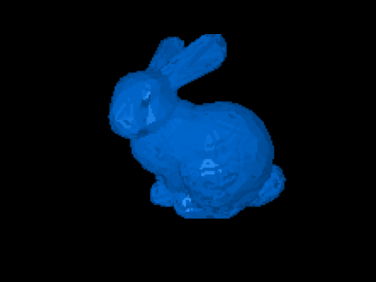

# Homework 7: Learning to Deform A Mesh

**Task 1. Implement an optimization loop that deforms a source mesh to a target mesh using PyTorch3D.**

| Iter=0 | Iter=100 | Iter=500 | Iter=1000 | ... | Target |
|:------:|:------:|:------:|:------:|:------:|:------:|
|||||...||

The `data` folder provides two meshes: bunny.obj as our learning target, and source.obj as the initial mesh. The task is to deform the initial mesh to the given bunny. See more information and hints in the `main.py` file.

> Note: An appropriate parameter setting on an NVIDIA RTX 2080Ti requires at least 30 minutes of computation and a minimum of 10000 iterations. The training may require excessive amount of debugging.
> There are also known bugs in pytorch3d, see https://github.com/facebookresearch/pytorch3d/issues/561 for more details and alternative solution if you found your loss got NaN after a few optimization steps.

**Task 2. Answer the following questions.**

1. What are the reasons that you choose the submitted loss function? How much possibilities have you tried and how long does it take you to train on what kind of hardware?

```
TODO: your answer goes here
```

2. Which part is the most time consuming for you to implement?

```
TODO: your answer goes here
```


## Submission Instruction

In short: Send a [pull request](https://github.com/mimuc/gp/pulls).

To submit a solution, one should create a folder named by the corresponding GitHub username in the `homeworks` folder and that folder will serve for all future submissions.

For example, in the `homeworks` folder, there is an existing folder `changkun`
that demonstrates how to organize submissions:

```
gp
├── README.md             <-- Top level README
├── 7-gdd2                <-- Project skeleton
└── homeworks
    └── changkun          <-- GitHub username
        └── 7-gdd2        <-- Actual submission
```