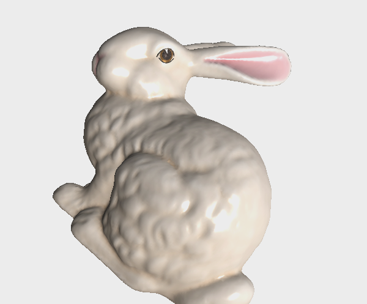
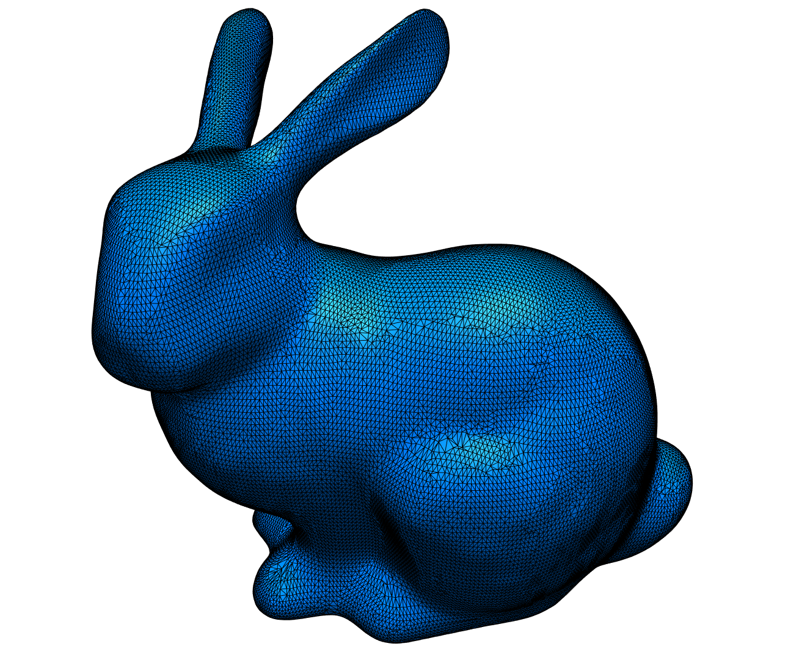
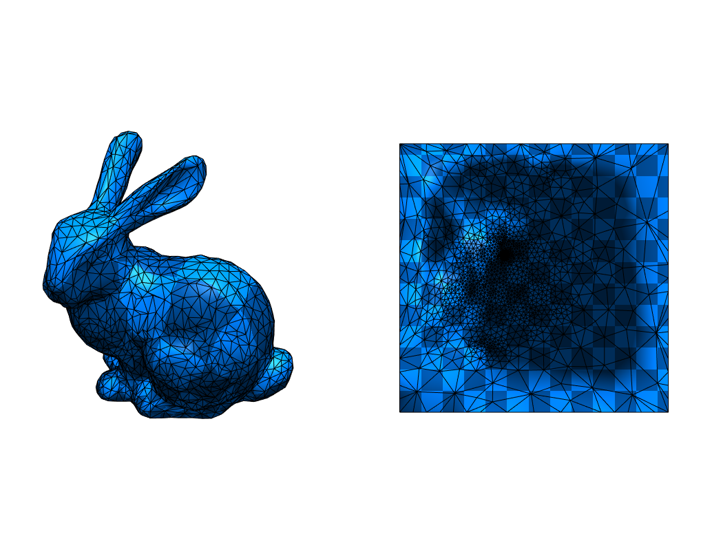
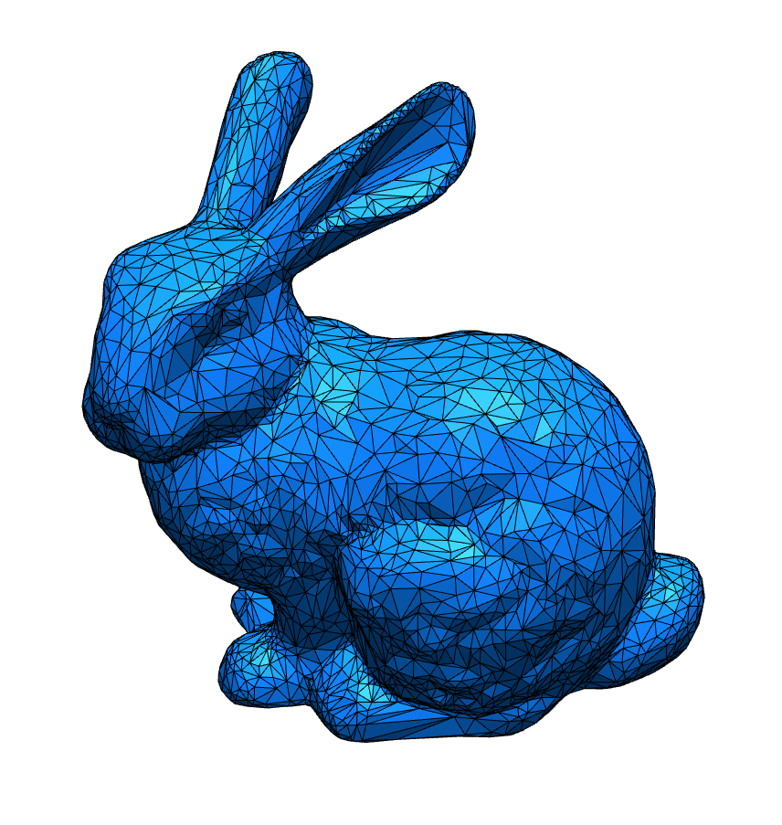
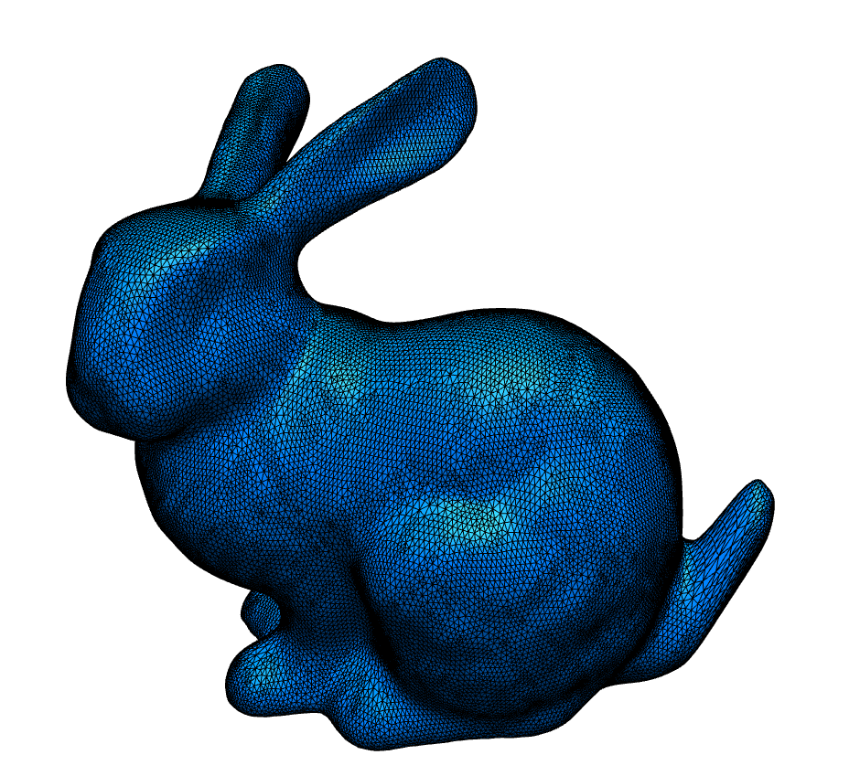

# Geometry Processing 

Geometry Processing @ LMU Munich Winter Semester 2020/21

- Homepage: [https://mimuc.de/gp](http://mimuc.de/gp)
- Instructor: [Changkun Ou](https://www.medien.ifi.lmu.de/team/changkun.ou/)
- Responsible Professor: [Prof. Dr. Butz](https://www.medien.ifi.lmu.de/team/andreas.butz/)
- Date: Monday, 2 p.m. - 6 p.m. (starts on Nov 2, 2020)
- Location: [Zoom](https://lmu-munich.zoom.us/j/98754182746)

## Prerequisites

The course is designed for senior bachelor students or master students
who have taken those following courses (or have equivalent knowledge):

- [Computer Graphics 1](https://www.medien.ifi.lmu.de/lehre/ss20/cg1/)

Registration is open at Uni2Work both for [Bachelor students](https://uni2work.ifi.lmu.de/course/W20/IfI/GP) and [Master students](https://uni2work.ifi.lmu.de/course/W20/IfI/PGP).

## Communication

We use our [GP GitHub repository](https://github.com/mimuc/gp-ws2021) to manage all course resources, submissions, project proposals, etc. and use the [discussions](https://github.com/mimuc/gp-ws2021/discussions) feature for online questions and discussions.

Please register yourself on GitHub if you do not have a GitHub account yet. You can use any distinguishable identifier for your username if you do not want your real name to appear on GitHub publicly.

## Preparation

Since we use GitHub to organize the course, it is recommended for you to get familiar with GitHub beforehand. The following tools are used in the course, please install them before you taking the course: [Blender](https://www.blender.org/) (2.90+), [Node.js](https://nodejs.org/en/) (v14+).

## Syllabus

In this practical course, students will learn and practice more about geometry processing algorithms in 3D graphics, including mesh representation, discrete differential geometry, smoothing, parameterization, remeshing, deformation, shape analysis, etc.

During the semester, students will participate in the course every two weeks to discuss and learn more geometry processing techniques, then do 5 out of 6 geometry processing coding projects.

Along the semester, students should propose a project idea, and by the end of semester, implement and demonstrate their project in 2-5 minutes in video format.

Organization slides: [Link](https://changkun.de/s/gp-0-org)

| Date | Topic | Projects | Preview |
|:----:|:------|:-----------------|:---:|
| 02.11.2020 | [Introduction](https://changkun.de/s/gp-1-intro) | [Rendering a Mesh](./homeworks/1-intro) |  |
| 16.11.2020 | [Discrete Differential Geometry](https://changkun.de/s/gp-2-ddg) | [Visualizing Curvatures](./homeworks/2-ddg) |  |
| 30.11.2020 | [Smoothing](https://changkun.de/s/gp-3-smooth) | [Laplacian Smoothing](./homeworks/3-smooth/) |  |
| 14.12.2020 | [Parameterization](https://changkun.de/s/gp-4-param) | [Tutte's Embedding](./homeworks/4-param/) |  |
| 11.01.2021 | [Remeshing](https://changkun.de/s/gp-5-remesh) | [Quadric Error Metric Simplification](./homeworks/5-remesh/) |  |
| 08.02.2021 | [Deformation](https://changkun.de/s/gp-6-deform)  | [Delta Mush](./homeworks/6-deform/README.md) |  |
| 08.02.2021 | [Data-driven Approach](https://changkun.de/s/gp-7-dda) | DGCNN for Normals |  |
| 22.02.2021 | Guest Talk: Industrial Modeling Practice | - |
| 01.03.2021 | Final Project Presentation | See below |

- Homework solutions:
  - Reference solution: [solutions/changkun](./homeworks/solutions/changkun)
  - Student submitted solutions: [solutions/krasnor](./homeworks/solutions/krasnor), [solutions/torantie](./homeworks/solutions/torantie), [solutions/nico778](./homeworks/solutions/nico778), [solutions/vseup](./homeworks/solutions/vseup)
- Final project submissions:
  - [krasnor](https://github.com/krasnor): Catmull-Clark Subdivision for A Halfedge-Mesh Structure. [Demo](https://youtu.be/GRI_i9wvukw), [Code](./projects/krasnor/README.md).
  - [torantie](https://github.com/torantie). Quadrilateral Mesh Smoothing with Mean Value Weights. [Demo](https://youtu.be/bVtcDBfH6eU), [Code](./projects/torantie/README.md).

## Grading

The grading scheme contains two parts: _coding projects_ and _individual project_.

### (50%) Coding Projects

Please check [this document](./homeworks/README.md) for further details for the submissions.

### (50%) Individual Project

Please check [this document](./projects/README.md) for further details for the submissions.

## License

GNU GPLv3 &copy; [mimuc.de/gp](https://mimuc.de/gp)