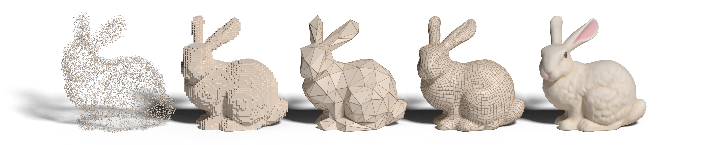
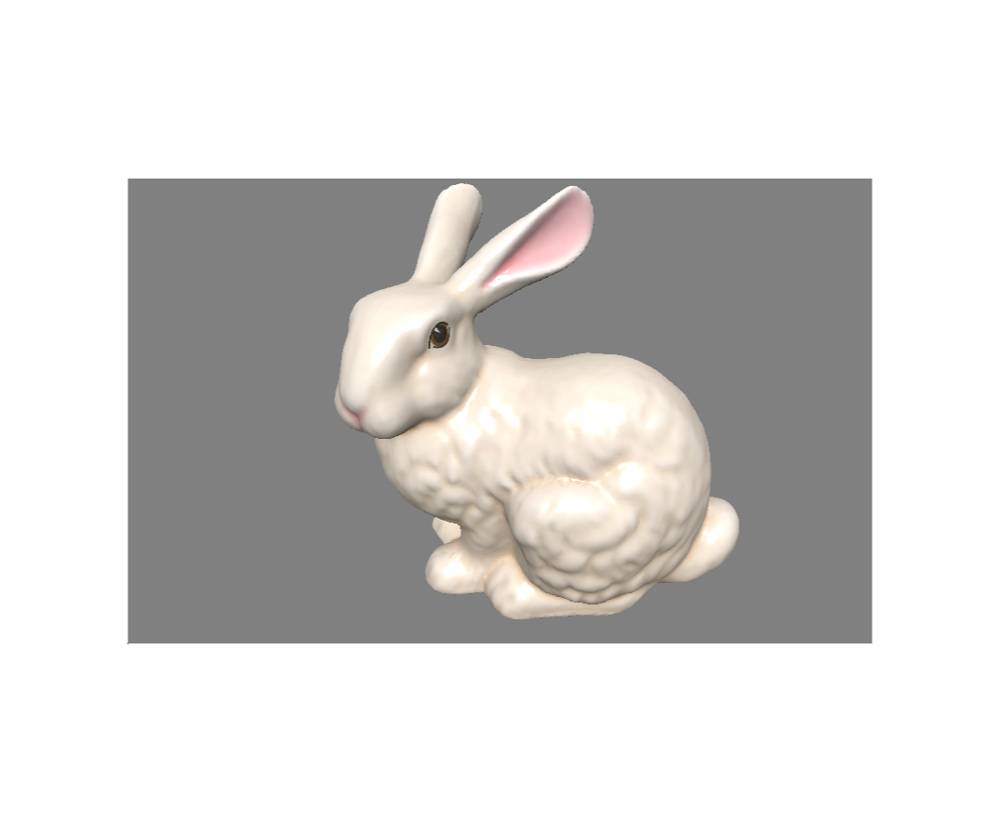
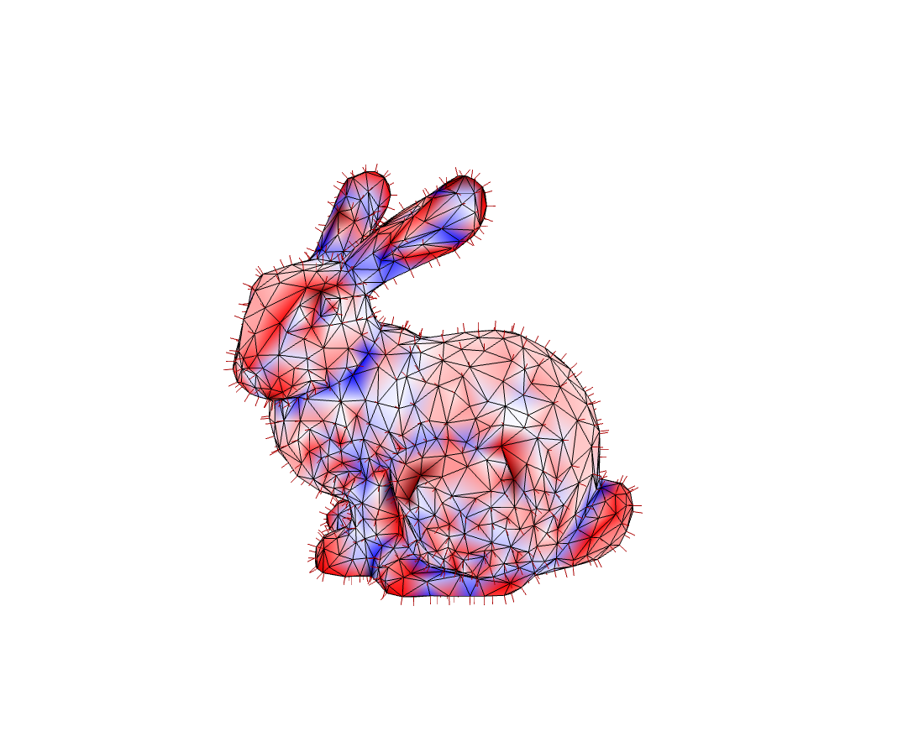
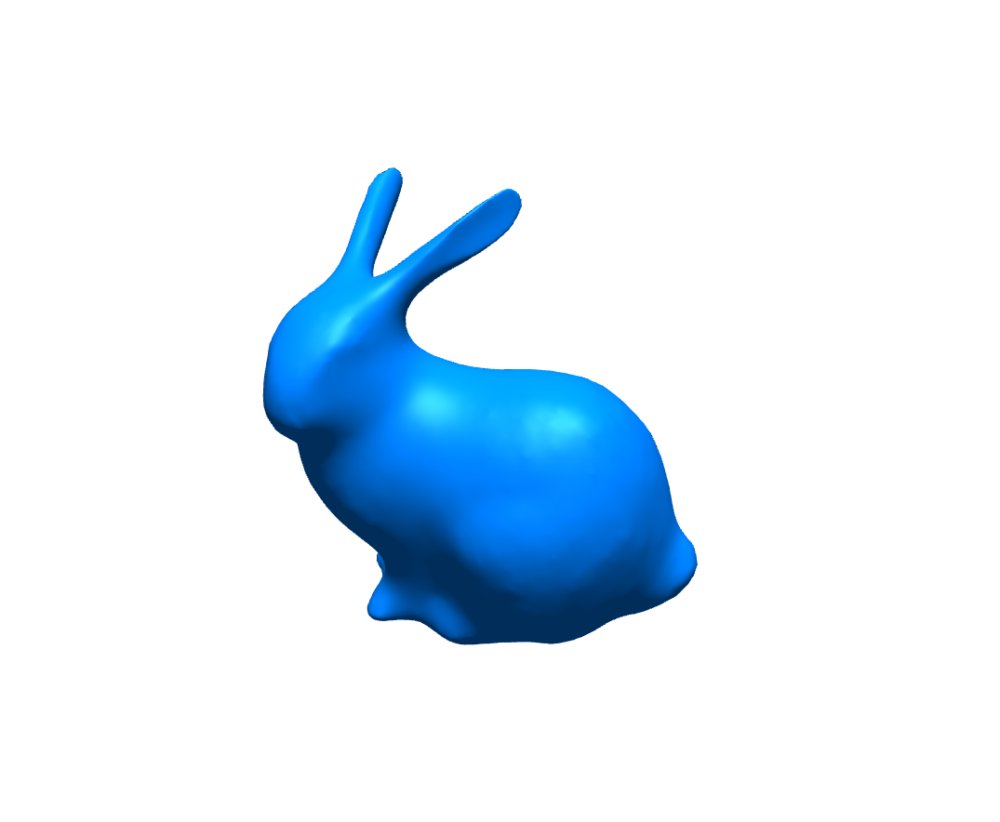
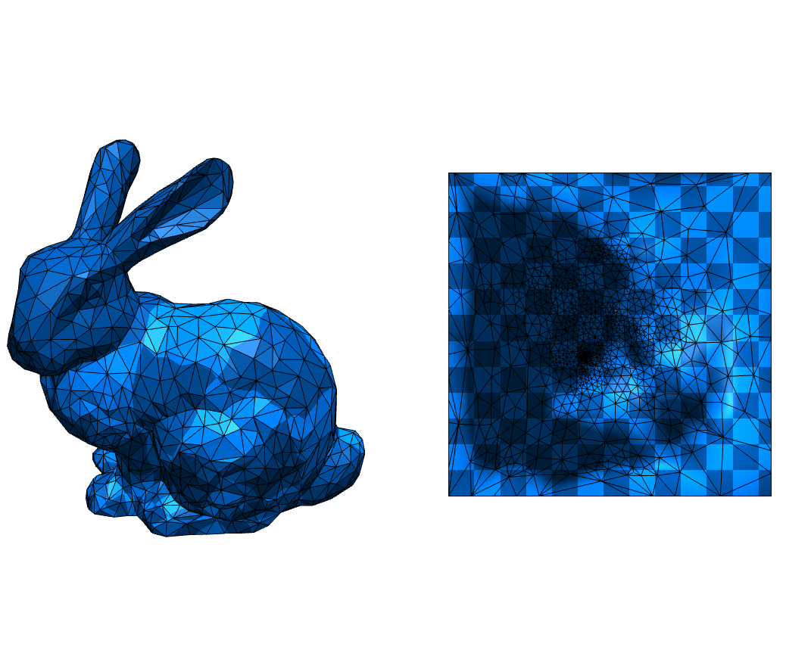
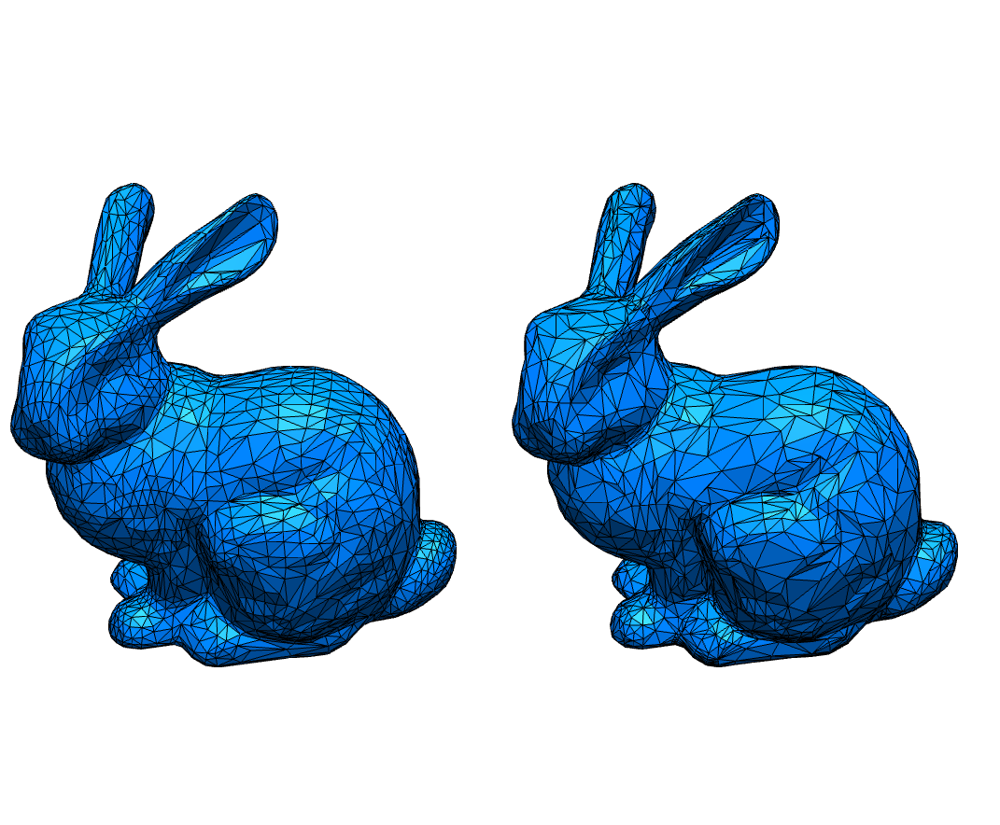
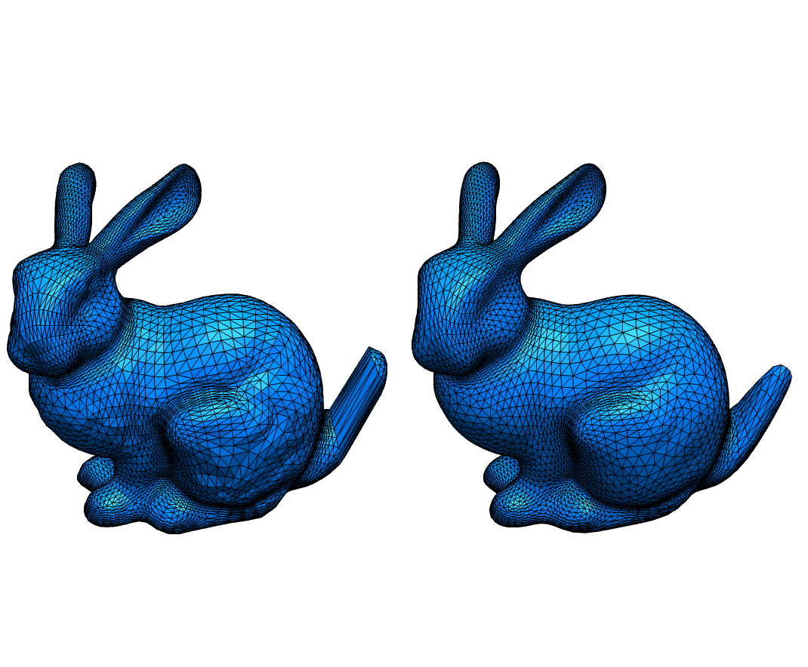
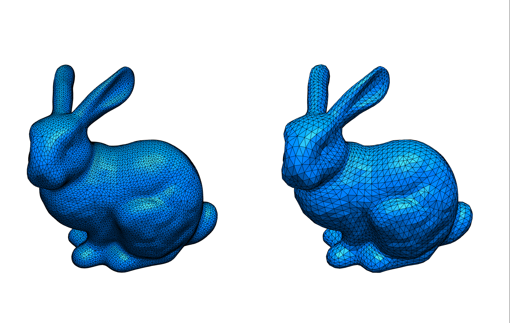
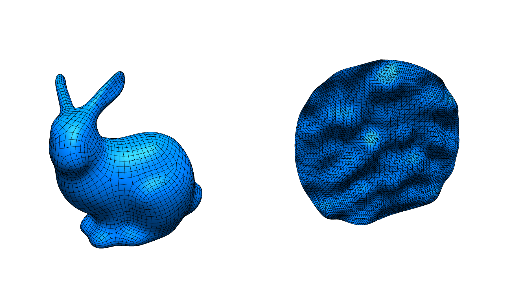

# Geometry Processing 

Geometry Processing @ LMU Munich Winter Semester 2020/21

- Homepage: [https://mimuc.de/gp](http://mimuc.de/gp)
- Instructor: [Changkun Ou](https://www.medien.ifi.lmu.de/team/changkun.ou/)
- Responsible Professor: [Prof. Dr. Butz](https://www.medien.ifi.lmu.de/team/andreas.butz/)
- Date: Monday, 2 p.m. - 6 p.m. (starts on Nov 2, 2020)
- Location: [Zoom](https://lmu-munich.zoom.us/j/98754182746)

## Prerequisites

The course is designed for senior bachelor students or master students
who have taken those following courses (or have equivalent knowledge):

- [Computer Graphics 1](https://www.medien.ifi.lmu.de/lehre/ss20/cg1/)

Registration is open at Uni2Work both for [Bachelor students](https://uni2work.ifi.lmu.de/course/W20/IfI/GP) and [Master students](https://uni2work.ifi.lmu.de/course/W20/IfI/PGP).
## Preparation

Since we use GitHub to organize the course, it is recommended for you to get familiar with GitHub beforehand. The following tools are used in the course, please install them before you taking the course: [Blender](https://www.blender.org/) (2.90+), [Node.js](https://nodejs.org/en/) (v14+).

## Syllabus

In this practical course, students will learn and practice more about geometry processing algorithms in 3D graphics, including mesh representation, discrete differential geometry, smoothing, parameterization, remeshing, deformation, shape analysis, etc.

During the semester, students will participate in the course every two weeks to discuss and learn more geometry processing techniques, then do 5 out of 6 geometry processing coding projects.

Along the semester, students should propose a project idea, and by the end of semester, implement and demonstrate their project in 2-5 minutes in video format.

### Materials

Organization slides: [Link](./slides/gp-ws2021-00-org.pdf)

| Date | Topic | Projects | Preview |
|:----:|:------|:-----------------|:---:|
| 02.11.2020 | [Introduction](./slides/gp-ws2021-01-intro.pdf) | [Rendering A Mesh on CPU](./homeworks/1-intro) |   [Live Demo](https://changkun.github.io/gp/ws2021/1-intro/) [Reference Solution](https://github.com/mimuc/gp/tree/ws2021/homeworks/solutions/changkun/1-intro) |
| 16.11.2020 | [Discrete Differential Geometry](./slides/gp-ws2021-02-ddg.pdf) | [Visualizing Curvatures](./homeworks/2-ddg) |   [Live Demo](https://changkun.github.io/gp/ws2021/2-ddg/) [Reference Solution](https://github.com/mimuc/gp/tree/ws2021/homeworks/solutions/changkun/2-ddg) |
| 30.11.2020 | [Smoothing](./slides/gp-ws2021-03-smooth.pdf) | [Laplacian Smoothing](./homeworks/3-smooth/) |   [Live Demo](https://changkun.github.io/gp/ws2021/3-smooth/) [Reference Solution](https://github.com/mimuc/gp/tree/ws2021/homeworks/solutions/changkun/3-smooth) |
| 14.12.2020 | [Parameterization](./slides/gp-ws2021-04-param.pdf) | [Tutte's Embedding](./homeworks/4-param/) |   [Live Demo](https://changkun.github.io/gp/ws2021/4-param/) [Reference Solution](https://github.com/mimuc/gp/tree/ws2021/homeworks/solutions/changkun/4-param) |
| 11.01.2021 | [Remeshing](./slides/gp-ws2021-05-remesh.pdf) | [Quadric Error Metric Simplification](./homeworks/5-remesh/) |   [Live Demo](https://changkun.github.io/gp/ws2021/5-remesh/) [Reference Solution](https://github.com/mimuc/gp/tree/ws2021/homeworks/solutions/changkun/5-remesh) |
| 08.02.2021 | [Deformation](./slides/gp-ws2021-06-deform.pdf)  | [Delta Mush](./homeworks/6-deform/README.md) |  |
| 08.02.2021 | [Data-driven Approach](./slides/gp-ws2021-07-dda.pdf) | DGCNN for Normals |  |
| 22.02.2021 | Guest Talk: Industrial Modeling Practice | - |
| 01.03.2021 | Final Project Presentation | See below |

- The project [discussions](https://github.com/mimuc/gp/discussions)
- The submission [code reviews](https://github.com/mimuc/gp/pulls?q=is%3Apr+is%3Aclosed+label%3Areviewed)

### Solutions

- Reference solution: [solutions/changkun](./homeworks/solutions/changkun)
- Student submitted solutions: [solutions/krasnor](./homeworks/solutions/krasnor), [solutions/torantie](./homeworks/solutions/torantie), [solutions/nico778](./homeworks/solutions/nico778), [solutions/vseup](./homeworks/solutions/vseup)

### Final Projects

| Student | Title | Preview |
|:--|:--|:--:|
|[krasnor](https://github.com/krasnor)|Catmull-Clark Subdivision for A Halfedge-Mesh Structure|    [Video Intro](https://youtu.be/GRI_i9wvukw), [Live Demo](https://changkun.github.io/gp/ws2021/final-krasnor/), [Code](./projects/krasnor/README.md)|
|[torantie](https://github.com/torantie)|Quadrilateral Mesh Smoothing with Mean Value Weights|   [Video Intro](https://youtu.be/bVtcDBfH6eU), [Live Demo](https://changkun.github.io/gp/ws2021/final-torantie/), [Code](./projects/torantie/README.md)|

## Grading

The grading scheme contains two parts: _coding projects_ and _individual project_.

### (50%) Coding Projects

Please check [this document](./homeworks/README.md) for further details for the submissions.

### (50%) Individual Project

Please check [this document](./projects/README.md) for further details for the submissions.

## License

GNU GPLv3 &copy; [mimuc.de/gp](https://mimuc.de/gp)