# Geometry Processing 

Geometry Processing @ LMU Munich Winter Semester 2021/22

- Homepage: [http://mimuc.de/gp](http://mimuc.de/gp)
- Instructor: [Changkun Ou](https://www.medien.ifi.lmu.de/team/changkun.ou/)
- Responsible Professor: [Prof. Dr. Butz](https://www.medien.ifi.lmu.de/team/andreas.butz/)
- Date: Monday, 2 p.m. - 6 p.m. [c.t.](https://en.wikipedia.org/wiki/Academic_quarter_(class_timing)) (starts on Oct 18, 2021)
- Location: Frauenlobstr. 7a, Raum 357

## Prerequisites

The course is designed for senior bachelor students or master students
who have taken those following courses (or have equivalent knowledge):

- [Computer Graphics 1](https://www.medien.ifi.lmu.de/lehre/ss21/cg1/)

Registration is open at [Uni2Work](https://uni2work.ifi.lmu.de/course/W21/IfI/GP).

## Preparation

We will introduce and use the following toolkits for this course:

- [Git](https://git-scm.com/downloads)
- [Blender](https://www.blender.org/) (2.93+)
- [Node.js](https://nodejs.org/en/) (14.17+)
- [Python](https://www.python.org/downloads/) (3.7+)

Please install all of them in advance and take a glance to these tools beforehand.

## Communication

We use [GitHub](https://github.com/mimuc/gp) to manage all course resources, submissions, project proposals, etc. and use the [discussions](https://github.com/mimuc/gp/discussions) feature for online questions and discussions.

## Syllabus

In this practical course, students will learn and practice more about geometry processing algorithms in 3D graphics, including mesh representation, discrete differential geometry, smoothing, parameterization, remeshing, deformation, shape analysis, etc.

Students will participate in the course every week to discuss and learn more geometry processing techniques at the beginning of the semester, then do 5 out of 8 geometry processing coding projects.

During the rest of the semester, students should propose a project idea throughout the semester, and by the end of the semester, implement and demonstrate their project in 1) idea-pitch presentation; 2) intermediate presentation; 3) final presentation.

| Date      | Topic                                            | Slides |
|:---------:|:-------------------------------------------------|:--:|
|           | Organization                                     | 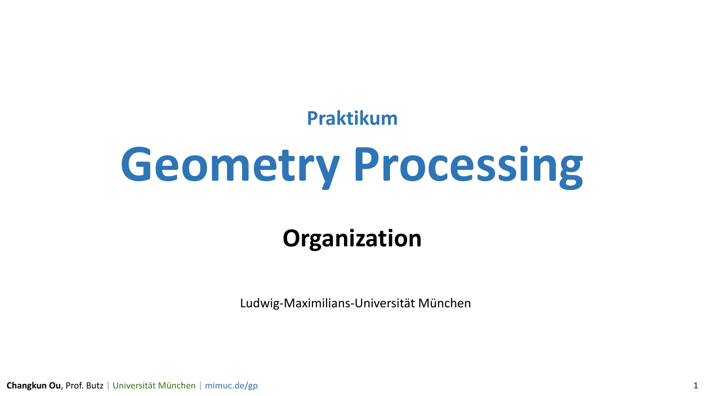   [Link](https://changkun.de/s/gp/ws21/0-org) |
|18.10.2021 | Introduction                                     | 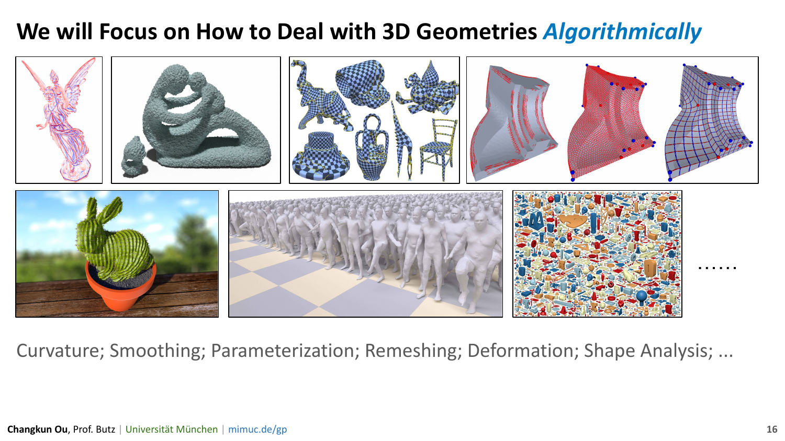   [Link](https://changkun.de/s/gp/ws21/1-intro) |
|25.10.2021 | Discrete Differential Geometry                   | 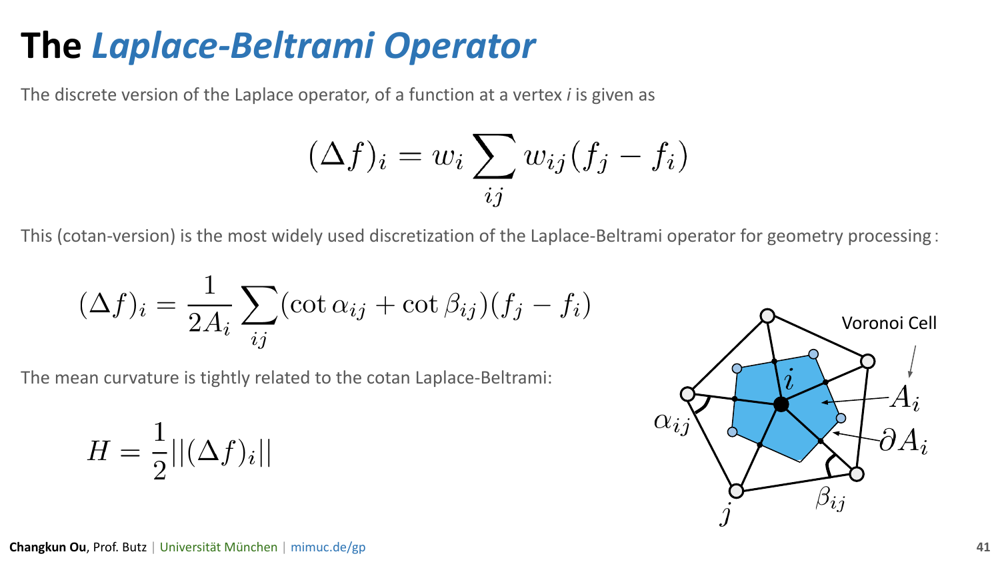   [Link](https://changkun.de/s/gp/ws21/2-ddg) |
|08.11.2021 | Smoothing                                        | 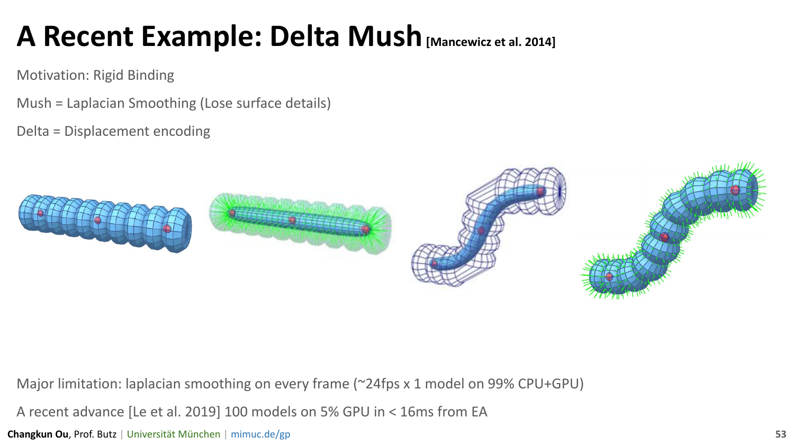   [Link](https://changkun.de/s/gp/ws21/3-smooth) |
|15.11.2021 | Parameterization                                 | 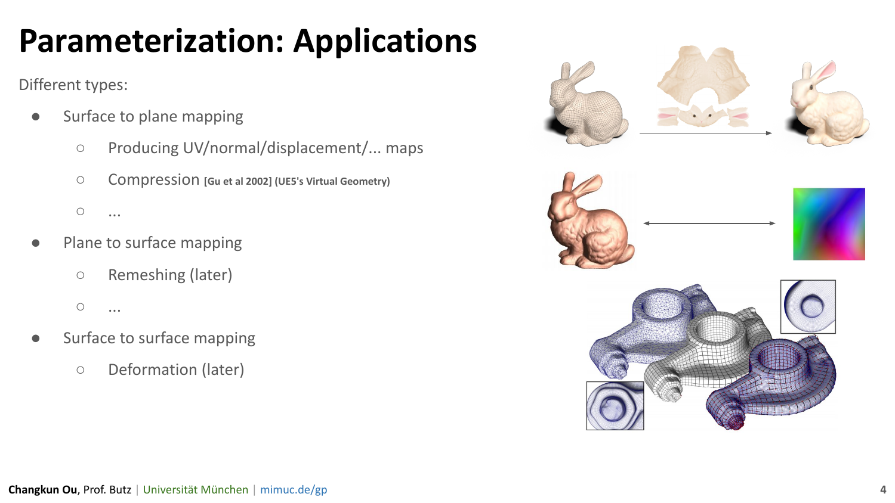   [Link](https://changkun.de/s/gp/ws21/4-param) |
|22.11.2021 | Remeshing                                        | 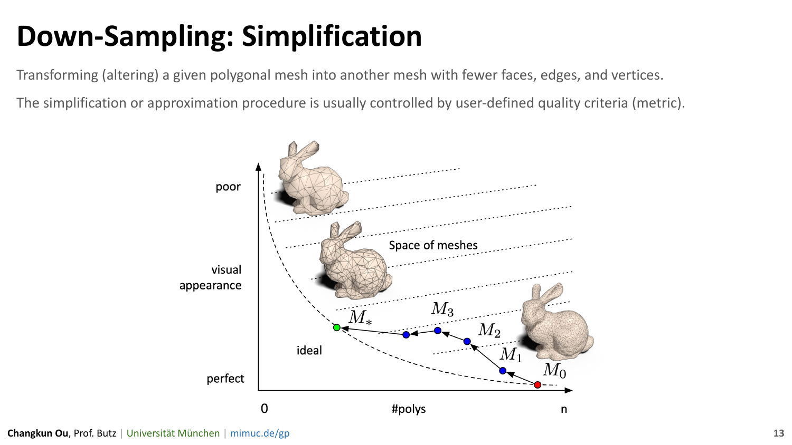   [Link](https://changkun.de/s/gp/ws21/5-remesh) |
|29.11.2021 | Deformation                                      | 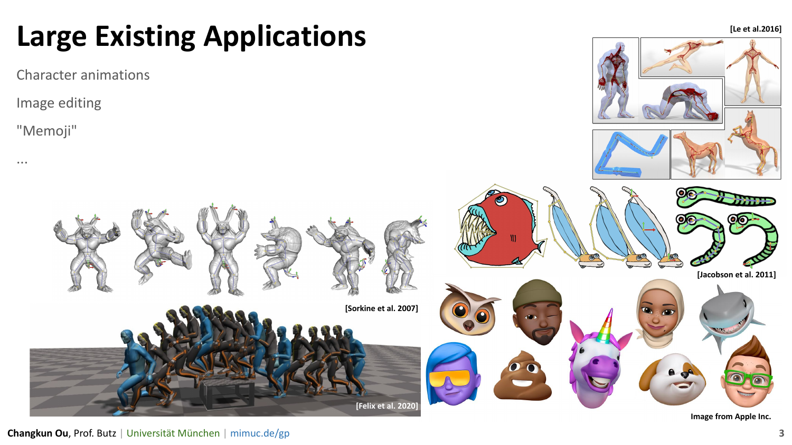   [Link](https://changkun.de/s/gp/ws21/6-deform) |
|06.12.2021 | Christmas Special: The Nanite System in Unreal Engine 5 | 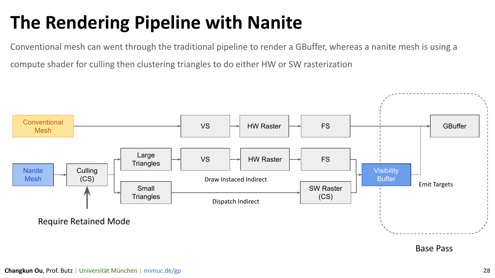   [Link](https://changkun.de/s/gp/ws21/extra1-nanite) |
|10.01.2021 | Data-driven Approach I | 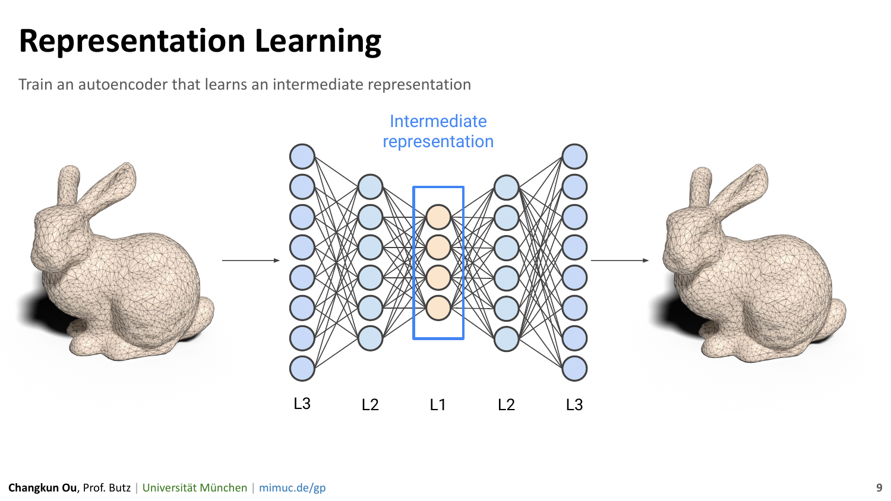   [Link](https://changkun.de/s/gp/ws21/7-dda) |
|24.01.2022 | Data-driven Approach II | 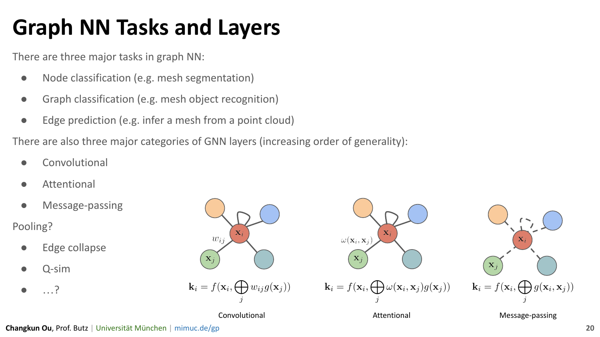   [Link](https://changkun.de/s/gp/ws21/8-dda2) |

## Grading

The grading scheme contains two parts: _**homework projects**_ and _**individual project**_.

### Homework Projects

Homework projects contribute 50% of the final grades.
Select 5 out of 7 given projects (5x10%), or feel free to finish them all (no bonus, but learn more interesting algorithms).

| Proportion | Topic | Deadline |
|:---:|:-------------------------------------------|:--------:|
| 10% | [The Halfedge Structure](./1-halfedge/) |   01.11.2021 23:59:59 |
| 10% | [Discrete Curvature](./2-ddg/) |   15.11.2021 23:59:59 |
| 10% | [Laplace Smooth](./3-smooth/) |   29.11.2021 23:59:59 |
| 10% | [Tutte's Embedding](./4-param/) |   13.12.2021 23:59:59 |
| 10% | [Quadric Error Metric Simplification](./5-remesh/) |    01.01.2022 23:59:59 |
| 10% | [Rendering with PyTorch(3D)](./6-dda1)        | 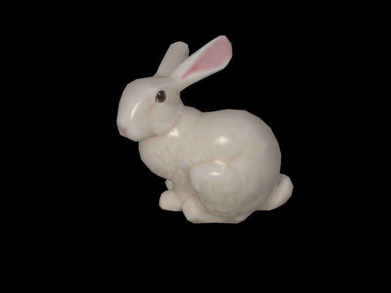   17.01.2022 23:59:59 |
| 10% | [Learning to Deform A Mesh](./7-dda2) | 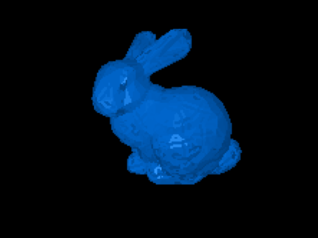   07.02.2022 23:59:59 |

### Individual Project

Individual projects contributes 50% of the final grade, and separated into parts:

- (10%) Proposal document, idea-pitch presentation (1 minute)
- (10%) Intermediate representation (5 minutes)
- (10%) Video submission (<5 minutes)
- (10%) Final presentation (10 minutes)
- (10%) Code submission

The timeline for individual projects are as follows:

| Events                 | Deadline            |
|:-----------------------|:-------------------:|
| Proposal Submission                 | 01.01.2022 23:59:59 |
| Project Presentation (Idea-Pitch)   | 24.01.2022 |
| Project Presentation (Intermediate) | 07.02.2022|
| Video Submission                    | 20.01.2022 23:59:59 |
| Presentation                        | 20.02.2022 23:59:59 |
| Code Submission                     | 20.02.2022 23:59:59 |
| Project Presentation (Final)        | 21.02.2022 |

Note that the individual project can be conducted in parallel with the coding projects,
meaning the individual projects can be submitted anytime before the deadline; Individual
projects do not mean students cannot collaborate with each other. A maximum of
three students can collaborate with each other to work on the same foundation of the
the project, but eventually each individual project should have their uniquely implemented
geometry processing algorithm or feature.

Find more details about how to do an individual project [here](./projects/README.md).

## Questions?

[Start a new discussion thread](https://github.com/mimuc/gp/discussions/new).

## License

Copyright &copy; 2020-2022 LMU Munich Media Informatics Group. Created by [Changkun Ou](https://changkun.de).
