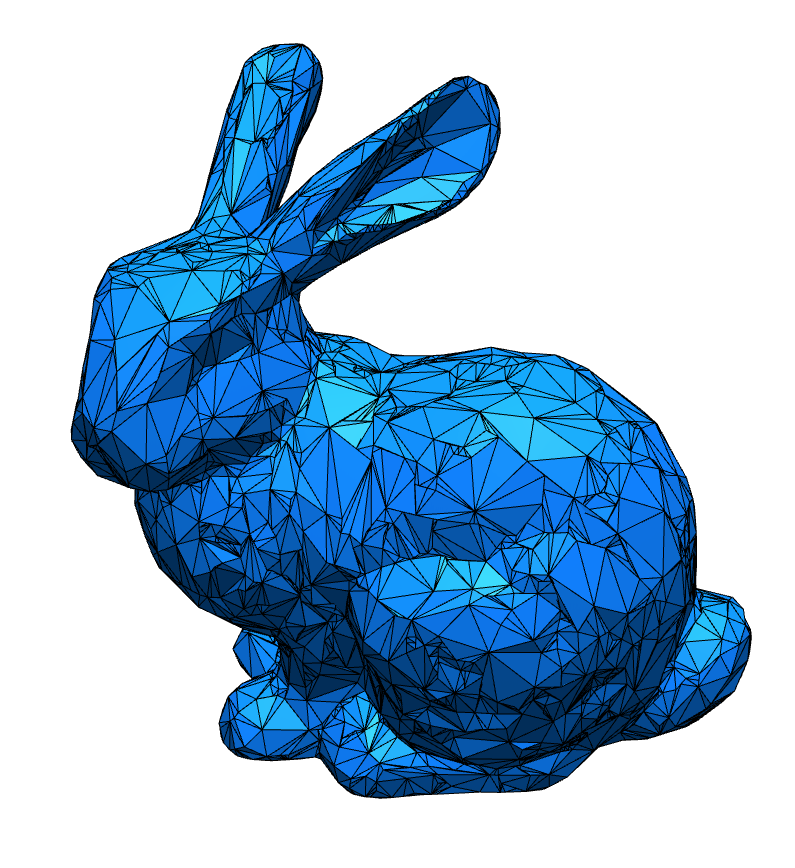
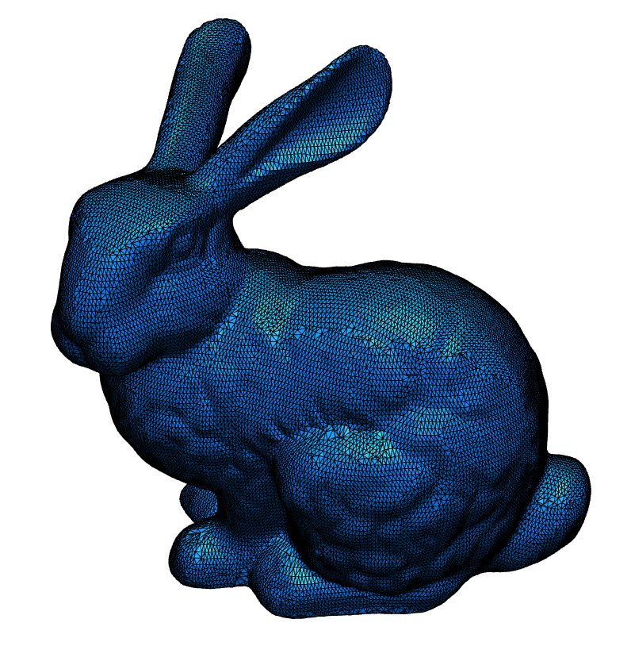
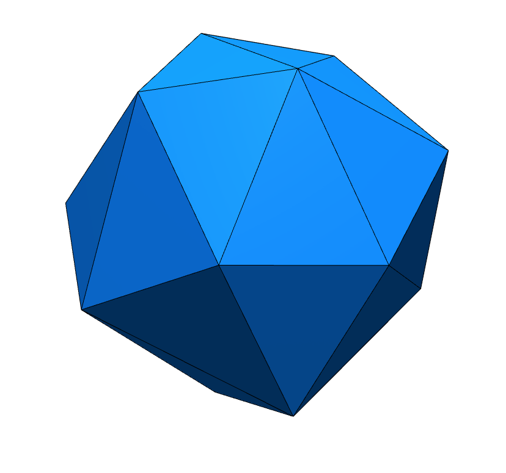
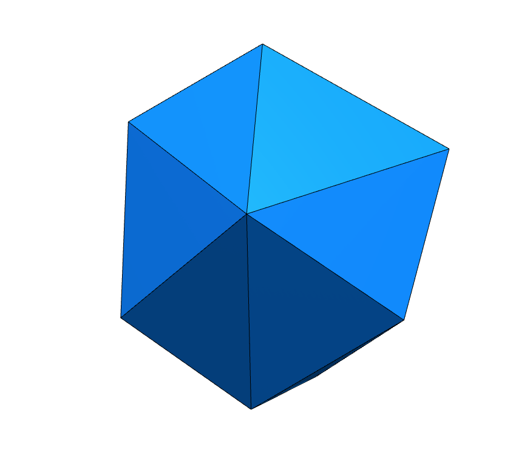
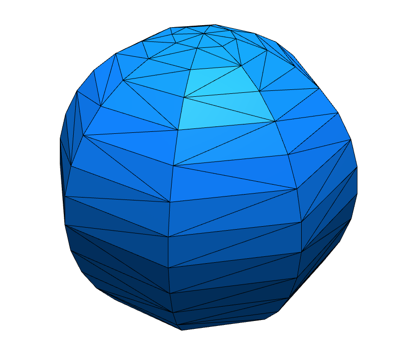

# Homework 5: Quadric Error Metric Simplification

In this homework, your task is to implement the
[QEM Simplification](https://dl.acm.org/doi/abs/10.1145/258734.258849)
algorithm.

## Skeleton

The skeleton for this homework is structured as follows:

```
5-remesh
├── package.json
├── package-lock.json
├── README.md                <-- You work on this file
├── src
│   ├── assets
│   │   ├── bunny_tri.obj
│   │   └── sphere.obj
│   ├── halfedge.js          <-- You work on this file
│   ├── main.js              <-- Change this file if needed
│   ├── mat.js
│   ├── pq.js
│   ├── renderer.js
│   └── vec.js
└── webpack.config.js
```

Implementation hints:

1. Your primary task is to implement the `Halfedge.simplify` method in the `halfedge.js`, but you will have to build halfedge representation of a given mesh first. Reuse your work from previous homeworks
2. Use `PriorityQueue` implementation from `pq.js` and `Matrix` implementation from `mat.js`
3. It might be useful to read the code in `main.js`, and you are allowed to change code there if needed

Think and answer the following questions:

1. What's the most unanticipated issue when you were implementing QEM? Explain your coding experience and encountered challenges briefly.
2. What are the cases missing from algorithm description, and how did you deal with it? For example, in which case you cannot do edge collapse directly. Explain your decision in your implementation.

```
TODO: your answer goes here
```

## Reference Results

The simplified meshes using different algorithms (0.9 reduction ratio):

|QEM[1] |Melax[2] |Original|
|:--:|:--:|:--:|
||||
||||

1. QEM: Garland, Michael, and Paul S. Heckbert. "Surface simplification using quadric error metrics." Proceedings of the 24th annual conference on Computer graphics and interactive techniques. 1997.
2. Melax: Melax, Stan. "A simple, fast, and effective polygon reduction algorithm." Game Developer 11.Nov (1998): 44-49.

## Submission

Before you submit, please read [this](../README.md) document and understand
how you should organize your submitted files.

For this project, you should submit the following files (i.e. exclude the `assets` folder):

```
├── package.json
├── package-lock.json
├── README.md
├── src
│   ├── halfedge.js
│   ├── main.js
│   ├── mat.js
│   ├── pq.js
│   ├── renderer.js
│   └── vec.js
└── webpack.config.js
```

To submit your solution, please send a [pull request](https://github.com/mimuc/gp-ws2021/pulls) before ~~25.01.2021~~ 08.02.2021 00:00:00.

If you have any questions regarding the skeleton, please comment on [the discussion thread](https://github.com/mimuc/gp-ws2021/discussions/5).