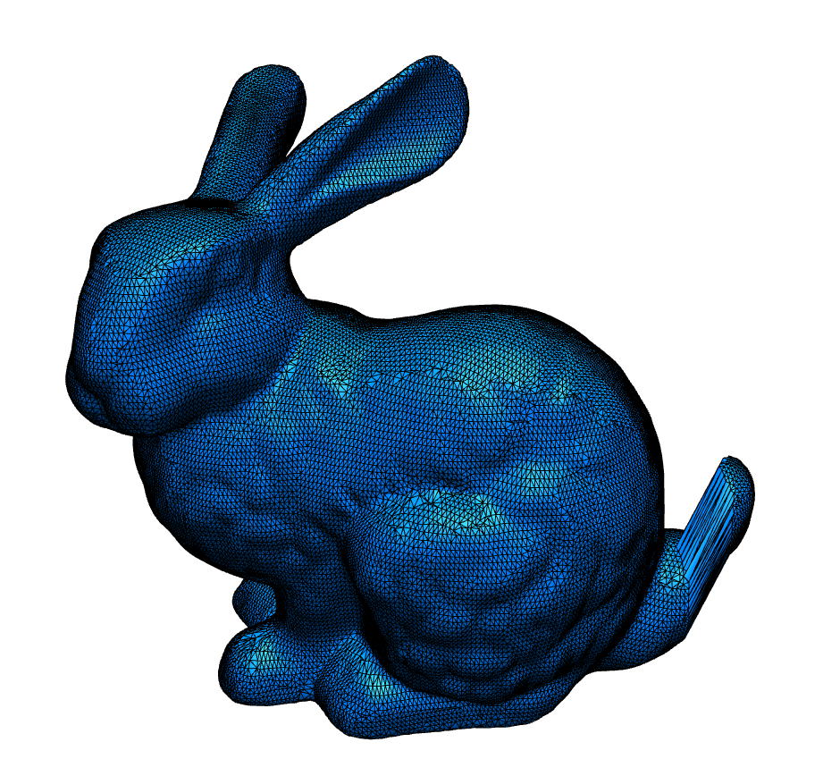
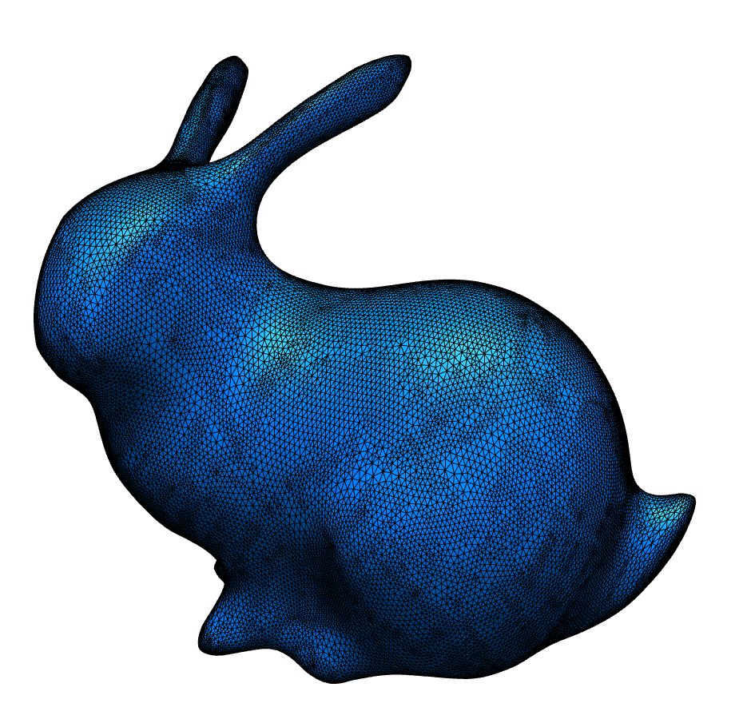

# Homework 6: Delta Mush

In this homework, your task is to implement the
[Delta Mush](https://dl.acm.org/doi/abs/10.1145/2633374.2633376)
algorithm.

## Skeleton

No skeleton provided, you are free to code anyhow you like :)

## Reference Results

| Original | Delta Mush (7 Iteration) | Delta Mush (70 Iteration) |
|:--:|:--:|:--:|
||||

Joe Mancewicz, Matt L. Derksen, Hans Rijpkema, and Cyrus A. Wilson. 2014. Delta Mush: smoothing deformations while preserving detail. In Proceedings of the Fourth Symposium on Digital Production (DigiPro '14). Association for Computing Machinery, New York, NY, USA, 7–11. DOI:https://doi.org/10.1145/2633374.2633376

## Submission

To submit your solution, please send a [pull request](https://github.com/mimuc/gp/pulls), no deadline.

If you have any questions regarding the skeleton, please comment on [the discussion thread](https://github.com/mimuc/gp/discussions/6).