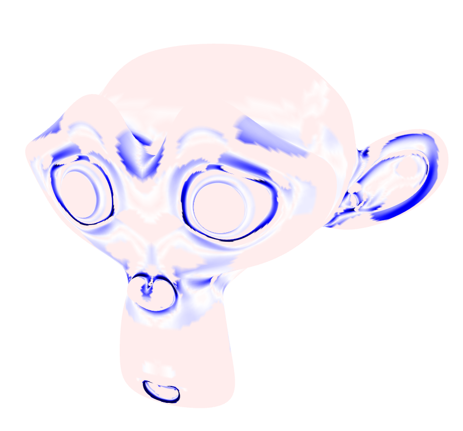

# Homework 2: Visualizing Curvatures

**Task 1. Use your halfedge mesh structure from [Homework 1](../1-halfedge/README.md), further extend the [geometry/primitive.ts](./src/geometry/primitive.ts) file and implement different normal and curvature computing methods.**

|Mean|Gauss|Kmin|Kmax|
|:--:|:--:|:--:|:--:|
|||||

**Task 2. Answer the following questions.**

Which code snippet (report in line numbers) in the `geometry/primitive.ts` is the most time consuming for you to implement? Explain your coding experience and encountered challenges briefly.

```
The most time consuming parts are calculating the kmin (line 310) or kmax (line 319) curvature since they require both the mean curvature and the gaussian curvature. The calculating the mean curvature is time consuming itself and is also the longest sub step when calculating kmin or kmax. 

The most challanging parts for me were the cotangend formular calculation and the voronoi area calculation, since it involves formulars which I dont fully understand. (I hope they are correct)
```

Describe an impressive bug that you wrote while implementing this project, and briefly explain how you fixed it.

```
When I started the program using my halfedge implementation it took minutes to load the halfedge structure from the obj file. So I needed to rewrite my halfedge implementation fron scratch with performance in mind.

Then when first calculating the gaussian curvature I ran into the issue that some halfedge previous and next links where not properly set. To find out why this happened I wrote a halfedge implementation test. Then I found out this was due to not explicitly linking halfedges that are at a boundary. So I had to fix the halfedge implementation to also create halfedge loops on boundaries.
```

## Submission Instruction

In short: Send a [pull request](https://github.com/mimuc/gp/pulls).

To submit a solution, one should create a folder named by the corresponding GitHub username in the `homeworks` folder and that folder will serve for all future submissions.

For example, in the `homeworks` folder, there is an existing folder `changkun`
that demonstrates how to organize submissions:

```
gp
├── README.md               <-- Top level README
├── 2-ddg                   <-- Project skeleton
└── homeworks
    └── changkun            <-- GitHub username
        └── 2-ddg           <-- Actual submission
```
