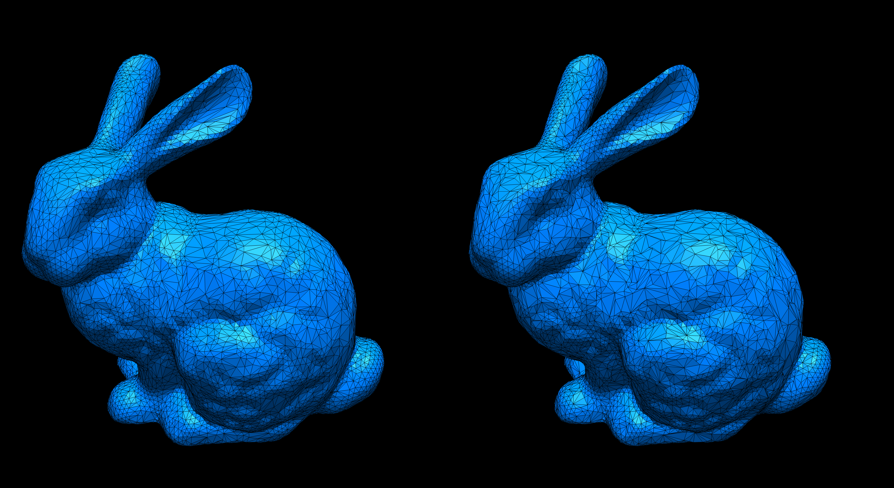
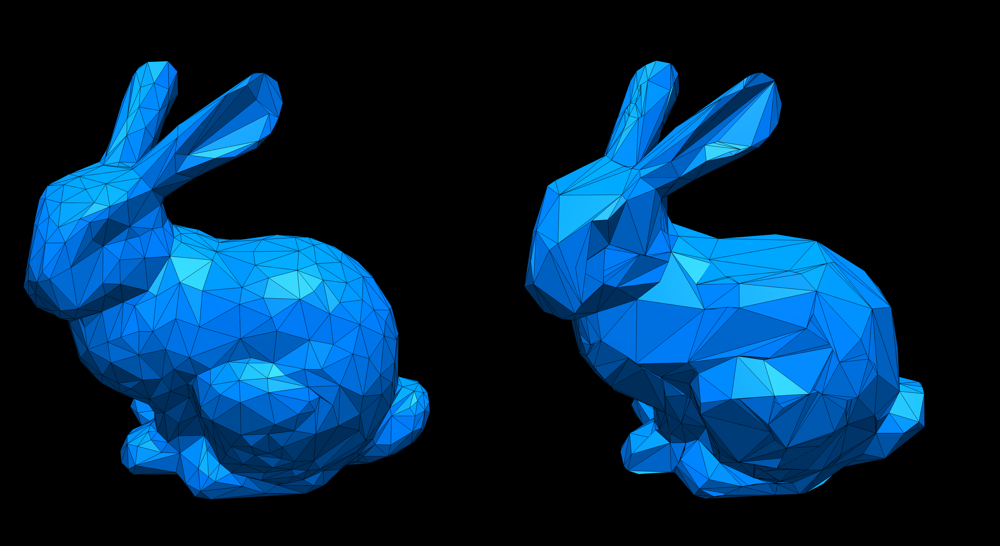
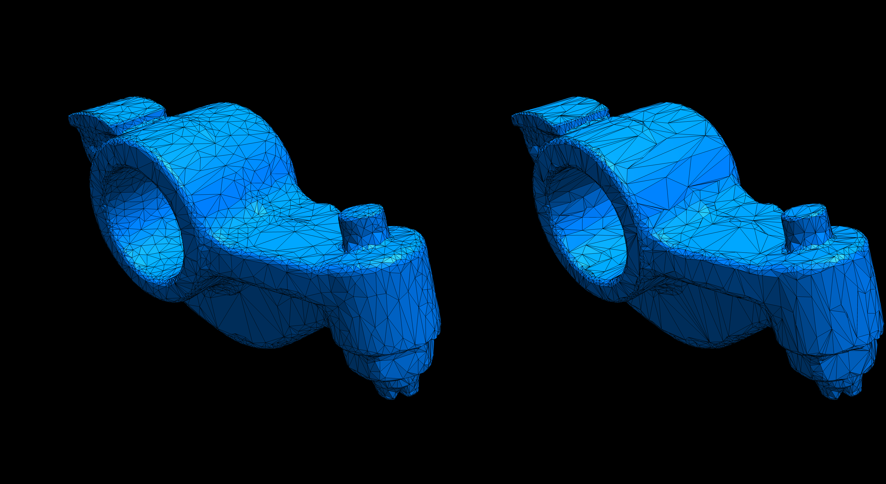

# Homework 5: Quadric Error Metric Simplification

**Task 1. Use the provided code template to implement the QSim algorithm (see `halfedge.ts` and `primitive.ts`).**

Here are example outputs:

|ReductionRatio|`r=0.0`|`r=0.50`|`t=0.90`|`t=0.95`|
|:--:|:--:|:--:|:--:|:--:|
|Bunny|||||
|Rocket ARM|||||

- Left: Simplified using Qsim (QEM)
- Right: Simplified using `SimplifyModifier` (from three.js)

**Task 2. Answer questions regarding the implementation.**

**Implementation complexity**: Which code snippet (report in line numbers) in the `geometry/primitive.ts` or `geometry/halfedge.ts` is the most time consuming for you to implement? Explain your coding experience and encountered challenges briefly.

```
The section in the simplifiy method where an edge is collapsed was the most time consuming to implement. This is due its complexity and the difficulty to debug errors. The code got stuck in an infinite loop and to find out the actual reason why I had to write alot of conditional tests and console logs all over the code to catch unexpected behaviour.
```

**Debugging complexity**: Describe an impressive bug that you wrote while implementing this project, and briefly explain how you fixed it.

```
I had alot of trouble making the code put out an result. It often got stuck in an infinite loop and never completed. I found a bug where two verts that are part of the faces of the collapsed edge where actually the same vert. I never expected this two happen and I still dont know why I occurs. Now I am checking for this case and skipping over these. Also when I improved the order of collapsing edges this got less common.
```

**Runtime performance**: Which part of your code could be a bottleneck and how the computation performance could be improved?

```
The sorting of the edges to collapse next can be a big bottleneck. It involves calulating the edge error which changes after each edge collapse and then comparing it to all other edges to find the order. To improve this I opted to update the error of edges only on those verts that where actualy affected by an edge collapse. To make the array holding the order more performant it only points to an entry of a map. And instead of pushing items into the array I set the fixed size in the begining and only remove items from the array.
```

## Submission Instruction

In short: Send a [pull request](https://github.com/mimuc/gp/pulls).

To submit a solution, one should create a folder named by the corresponding GitHub username in the `homeworks` folder and that folder will serve for all future submissions.

For example, in the `homeworks` folder, there is an existing folder `changkun`
that demonstrates how to organize submissions:

```
gp
├── README.md               <-- Top level README
├── 5-remesh                <-- Project skeleton
└── homeworks
    └── changkun            <-- GitHub username
        └── 3-smooth        <-- Actual submission
```
