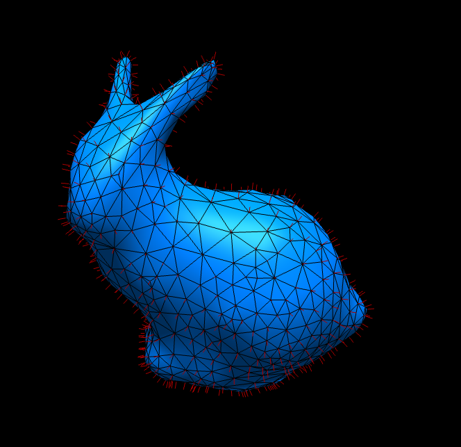
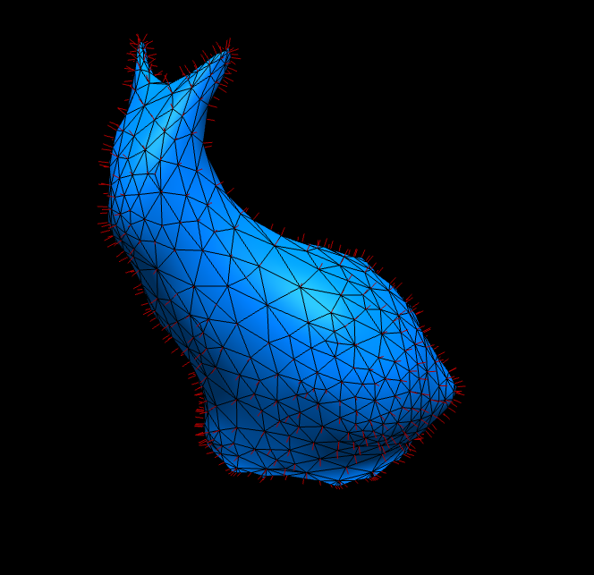
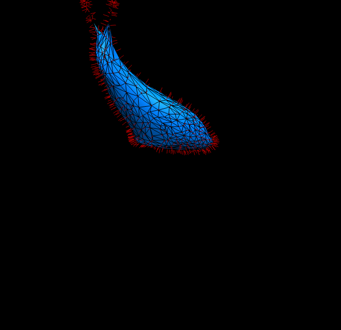
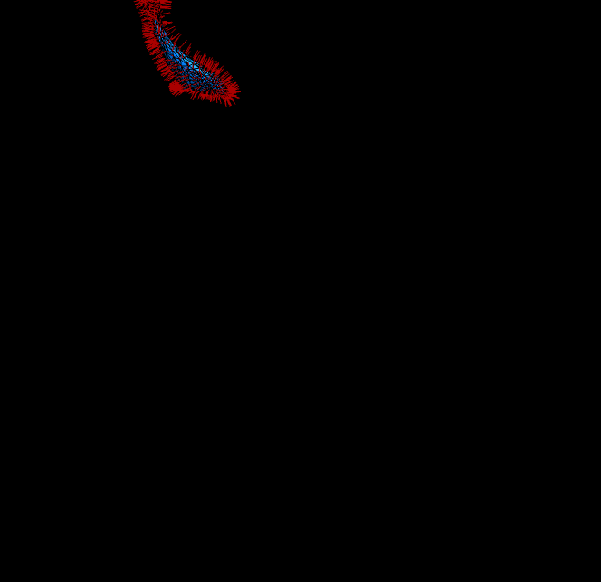

# Homework 3: Laplacian Smoothing

**Task 1. Use your halfedge mesh structure from [Homework 1](../1-halfedge/README.md), further extend the [geometry/halfedge.ts](./src/geometry/halfedge.ts) and [geometry/primitive.ts](./src/geometry/primitive.ts) file and implement the Laplacian smoothing algorithm for the **uniform** and the **cotan** Laplace-Beltrami operator.**

The initial setup is a black screen, and the smoothed version of the original bunny mesh:

|Laplacian|`t=0.500`|`t=2.000`|`t=5.000`|`t=10.000`|
|:--:|:--:|:--:|:--:|:--:|
|Uniform|||||
|Cotan|||||
|Uniform|||||
|Cotan|||||

where `t` is the time step and all reference results are performed for `1` smooth step.

**Task 2. Answer questions regarding the implementation.**

**Implementation complexity**: Which code snippet (report in line numbers) in the `geometry/primitive.ts` or `geometry/halfedge.ts` is the most time consuming for you to implement? Explain your coding experience and encountered challenges briefly.

```
Probably the laplaceWeightMatrix() function, simply because it was the largest part.
The problem math-heavy tasks, however, is that most of the time is spent understanding the problem and not the actual programming.
Here, I spent most of the time trying to figure out what the individual variables meant (time step, smooth step, lambda, h, ...) and how various things are calculated.
Unfortunately, very small mistakes lead to very large problems.
It also did not help that debugging was relatively hard in this case.
```

**Debugging complexity**: Describe an impressive bug that you wrote while implementing this project, and briefly explain how you fixed it.

```
The first implementation produced a seriously disfigured, spiky bunny.
That bug was mainly caused by using timeStep incorrectly (using it as iteration, rather than multiplying it).
Another bug was caused by very small/large entries in the mass matrix for cotan smoothing.
Other than that, everything went pretty 'smooth' (sorry for the joke).
```

**Runtime performance**: Which part of your code could be a bottleneck and how the computation performance could be improved?

```
The neighbor vertices are computed and iterated multiple times during the mass and weight matrix calculations.
Also, the function calls create additional overhead.
Everything could probably collapsed into a single loop.

Also, every time the smoothing is applied, all vertices are first reset, because the vertex area (for cotan) is calculated on the verts and not vertsOrig.
- Ok, I 'fixed' that by using the voronoi cell, which works with the original vertices. The results are more or less the same, but this should be a bit faster. The code resetting the vertices has been commented out, and the matrix f is now initialised with vertsOrig.
```

## Submission Instruction

In short: Send a [pull request](https://github.com/mimuc/gp/pulls).

To submit a solution, one should create a folder named by the corresponding GitHub username in the `homeworks` folder and that folder will serve for all future submissions.

For example, in the `homeworks` folder, there is an existing folder `changkun`
that demonstrates how to organize submissions:

```
gp
├── README.md               <-- Top level README
├── 3-smooth                <-- Project skeleton
└── homeworks
    └── changkun            <-- GitHub username
        └── 3-smooth        <-- Actual submission
```
