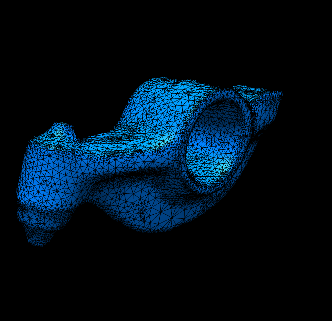

# Homework 3: Laplacian Smoothing

**Task 1. Use your halfedge mesh structure from [Homework 1](../1-halfedge/README.md), further extend the [geometry/halfedge.ts](./src/geometry/halfedge.ts) and [geometry/primitive.ts](./src/geometry/primitive.ts) file and implement the Laplacian smoothing algorithm for the **uniform** and the **cotan** Laplace-Beltrami operator.**

The initial setup is a black screen, and the smoothed version of the original bunny mesh:

|Laplacian|`t=0.500`|`t=2.000`|`t=5.000`|`t=10.000`|
|:--:|:--:|:--:|:--:|:--:|
|Uniform|||||
|Cotan|||||
|Uniform|||||
|Cotan|||||

where `t` is the time step and all reference results are performed for `1` smooth step.

**Task 2. Answer questions regarding the implementation.**

**Implementation complexity**: Which code snippet (report in line numbers) in the `geometry/primitive.ts` or `geometry/halfedge.ts` is the most time consuming for you to implement? Explain your coding experience and encountered challenges briefly.

```
I think it was lines 376, and 379 which are calculating the new positions with the cholesky solver.

At first i didn't really know how to translte the formula to code, and how the f(t), and f(t+h) Matrix should be stored and used in the calculations, and with the cholesky solver.
```

**Debugging complexity**: Describe an impressive bug that you wrote while implementing this project, and briefly explain how you fixed it.

```
Again i don't think it's an impressive bug ^^
The time slider was not working backwards, and the mesh used to get smoothed infinitely.

The problem was at fisrt not using the original Vertex Positions, when constructing the matricies, but it didnt go away after i fixed that.
The problem then was that i constructed the original vertices with the verts[i].position which meant they updated with the current vertex position.
The Solution was creating a new Vector Object for the original vertices.

```

**Runtime performance**: Which part of your code could be a bottleneck and how the computation performance could be improved?

```
I'm not sure, i think returning the matrices directly instead of the Triplet might use more memory then needed, but im not sure, since they are sparse Matrices, and i can't really tell how much that would hinder performance in general.
```

## Submission Instruction

In short: Send a [pull request](https://github.com/mimuc/gp/pulls).

To submit a solution, one should create a folder named by the corresponding GitHub username in the `homeworks` folder and that folder will serve for all future submissions.

For example, in the `homeworks` folder, there is an existing folder `changkun`
that demonstrates how to organize submissions:

```
gp
├── README.md               <-- Top level README
├── 3-smooth                <-- Project skeleton
└── homeworks
    └── changkun            <-- GitHub username
        └── 3-smooth        <-- Actual submission
```
