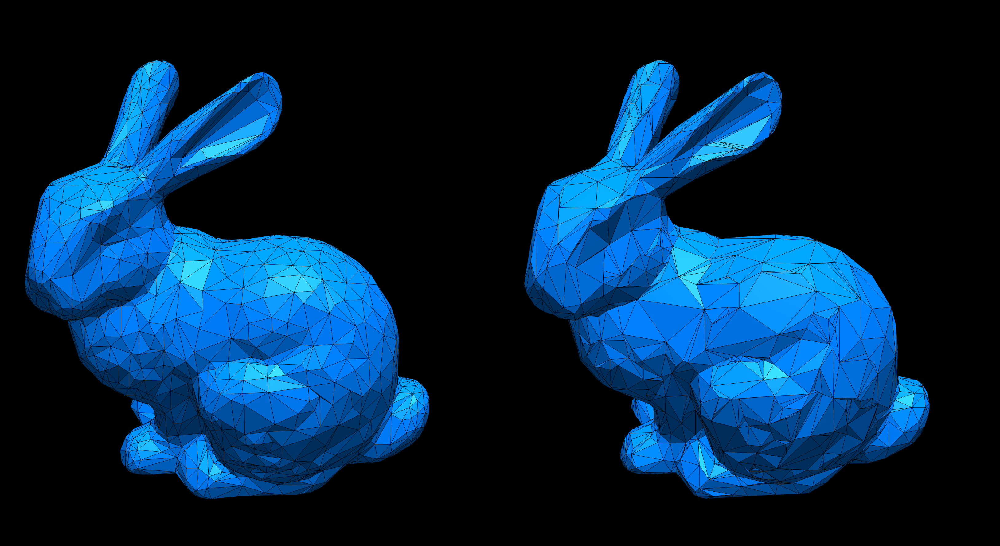
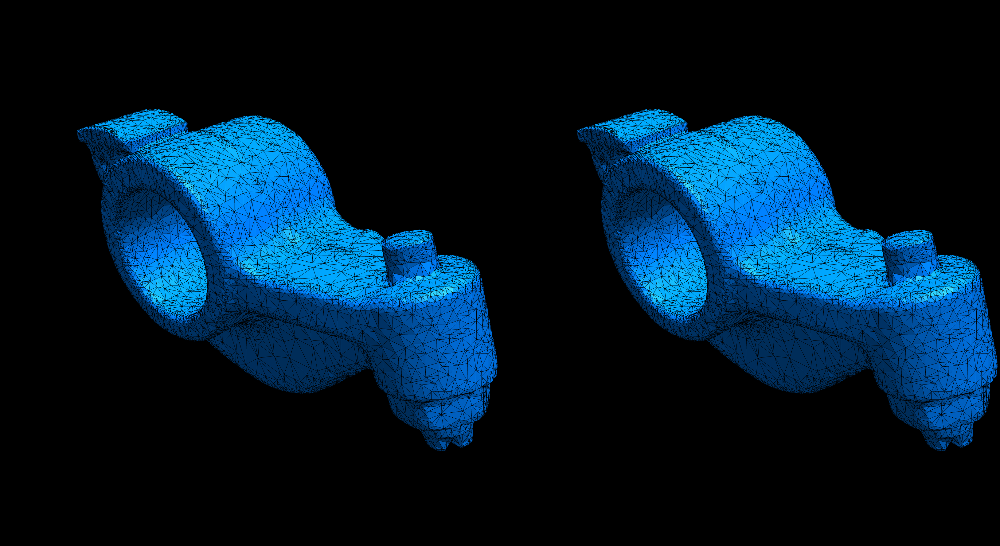
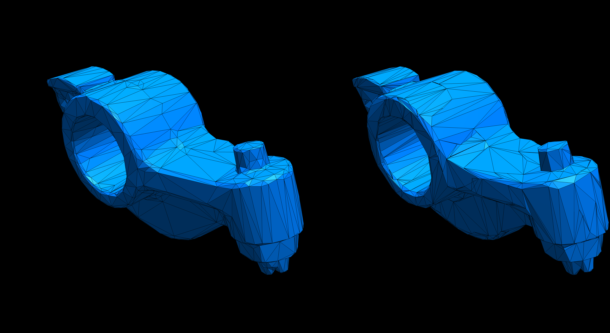

# Homework 5: Quadric Error Metric Simplification

**Task 1. Use the provided code template to implement the QSim algorithm (see `halfedge.ts` and `primitive.ts`).**

Here are example outputs:

|ReductionRatio|`r=0.0`|`r=0.50`|`t=0.90`|`t=0.95`|
|:--:|:--:|:--:|:--:|:--:|
|Bunny|||||
|Rocket ARM|||||

- Left: Simplified using Qsim (QEM)
- Right: Simplified using `SimplifyModifier` (from three.js)

**Task 2. Answer questions regarding the implementation.**

**Implementation complexity**: Which code snippet (report in line numbers) in the `geometry/primitive.ts` or `geometry/halfedge.ts` is the most time consuming for you to implement? Explain your coding experience and encountered challenges briefly.

```
Most time consuming was the edge collapse (basically all of it) since i missed some stuff, when i thought it through, and then it was very very time consuming to debug it
```

**Debugging complexity**: Describe an impressive bug that you wrote while implementing this project, and briefly explain how you fixed it.

```
When doing the edge collapse, i didn't reassign halfedges for the vertices of the deleted faces, which then resulted in an infinite loop in the Vertex.halfedges() function
```

**Runtime performance**: Which part of your code could be a bottleneck and how the computation performance could be improved?

```
There is A LOT to improve here:

1.
The Priority Queue didn't really work with my implementation for the edge collapse, so as a workaround the edge-queue gets newly built every simplification round (which kind of defeats the purpose of the queue, but since it was hell to debug this i didn't want to touch it anymore, once it was finally working... ^^)
The reason for this is, that i a retaining all the halfedge connectivity, that does not get deleted during the edge collapse, which sounds like it would benefit performace, but probably causes issues, since i think the position in the EdgeQueue doesn't automatically update, when the Edge Objects, stay the same

2.
The position of the best vertex for each edge is already determined, when the error is calculated, so it could be saved as an attribute for the edge, rather then calling bestVertex() again, when simplifying it

3.
Resetindices is called after every edge collapse. That is probably not necessary
```

## Submission Instruction

In short: Send a [pull request](https://github.com/mimuc/gp/pulls).

To submit a solution, one should create a folder named by the corresponding GitHub username in the `homeworks` folder and that folder will serve for all future submissions.

For example, in the `homeworks` folder, there is an existing folder `changkun`
that demonstrates how to organize submissions:

```
gp
├── README.md               <-- Top level README
├── 5-remesh                <-- Project skeleton
└── homeworks
    └── changkun            <-- GitHub username
        └── 3-smooth        <-- Actual submission
```
