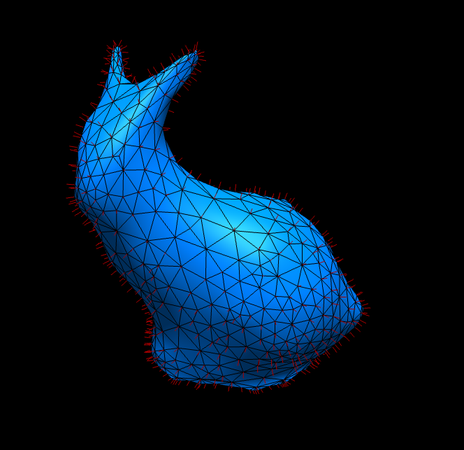
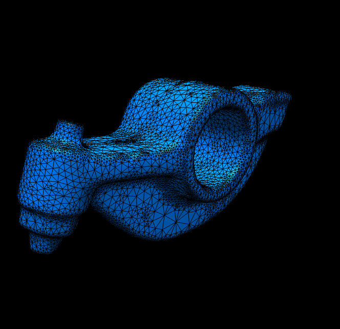
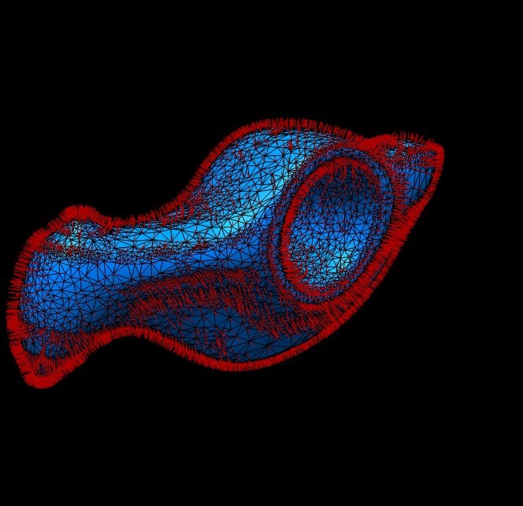

# Homework 3: Laplacian Smoothing

**Task 1. Use your halfedge mesh structure from [Homework 1](../1-halfedge/README.md), further extend the [geometry/halfedge.ts](./src/geometry/halfedge.ts) and [geometry/primitive.ts](./src/geometry/primitive.ts) file and implement the Laplacian smoothing algorithm for the **uniform** and the **cotan** Laplace-Beltrami operator.**

The initial setup is a black screen, and the smoothed version of the original bunny mesh:

|Laplacian|`t=0.500`|`t=2.000`|`t=5.000`|`t=10.000`|
|:--:|:--:|:--:|:--:|:--:|
|Uniform|||||
|Cotan|||||
|Uniform|||||
|Cotan|||||

where `t` is the time step and all reference results are performed for `1` smooth step.

**Task 2. Answer questions regarding the implementation.**

**Implementation complexity**: Which code snippet (report in line numbers) in the `geometry/primitive.ts` or `geometry/halfedge.ts` is the most time consuming for you to implement? Explain your coding experience and encountered challenges briefly.

```
Calculating the laplacianWeight and mass matrix was much more straight forward than implementing the actual smoothing method. Chalanges I encountered were the lacking documentation for @penrose/linear algebra (at least VSCode as IDE did not import the documentation) and implementing the cholasky solver.
```

**Debugging complexity**: Describe an impressive bug that you wrote while implementing this project, and briefly explain how you fixed it.

```
Just 1 wrong line of code can have funny results: 
```

**Runtime performance**: Which part of your code could be a bottleneck and how the computation performance could be improved?

```
With the 'vertsOrg' hack both the laplacianWeightMatrix and the mass matrix do not change during each smoth step. Therefore, one could easily move this part out
of the "smooth step loop" as well as creating the cholasky solver. This would probably make the biggest difference.
```

## Submission Instruction

In short: Send a [pull request](https://github.com/mimuc/gp/pulls).

To submit a solution, one should create a folder named by the corresponding GitHub username in the `homeworks` folder and that folder will serve for all future submissions.

For example, in the `homeworks` folder, there is an existing folder `changkun`
that demonstrates how to organize submissions:

```
gp
├── README.md               <-- Top level README
├── 3-smooth                <-- Project skeleton
└── homeworks
    └── changkun            <-- GitHub username
        └── 3-smooth        <-- Actual submission
```
