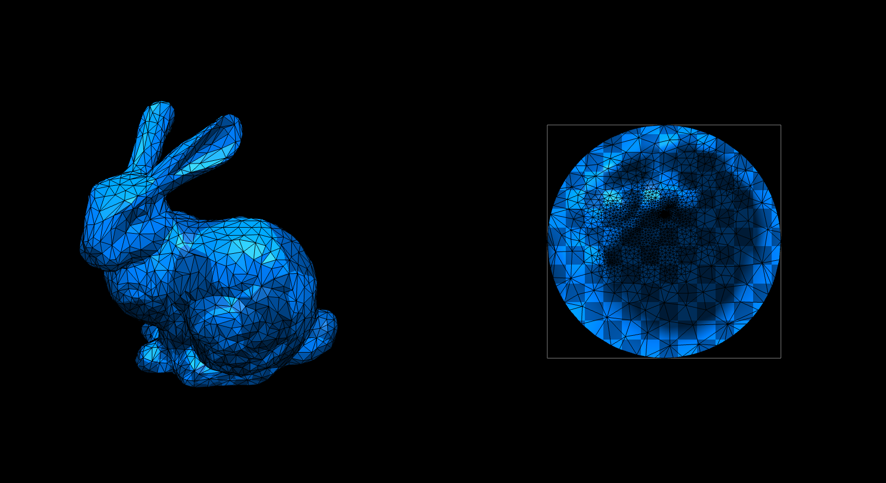

# Homework 4: Tutte's Barycentric Embedding

**Task 1. Use your halfedge mesh structure from [Homework 1](../1-halfedge/README.md), further extend the [geometry/mesh_param.ts](./src/geometry/mesh_param.ts) file and implement Tutte's barycentric embedding algorithm for mesh parameterization using for **uniform** and the **cotan** Laplacian weights.**

The original bunny mesh and parameterization:


The computed Tutte's parameterization:

|Laplacian|Disk|Rectangle|
|:--:|:--:|:--:|
|Uniform|||
|Cotan|||

_*Note that a mesh must contain at least one boundary._

**Task 2. Answer questions regarding the implementation.**

**Implementation complexity**: Which code snippet (report in line numbers) in the `geometry/mesh_param.ts` is the most time consuming for you to implement? Explain your coding experience and encountered challenges briefly.

```
Since the steps that need to be done were laid out quite well in this assignment, it was not hard to implement. However,implementing the "computeInteriorMatrix" method took some time since I forgot to "zero out" the boundary vertices.
```

**Debugging complexity**: Describe an impressive bug that you wrote while implementing this project, and briefly explain how you fixed it.

```
For some reason, the renderer requires the v coordinate in the lower left corner to be close but not equal to 0. (see computeBoundaryMatrices & BoundaryType==rect) Line 164 in mesh_param.
```

**Runtime performance**: Which part of your code could be a bottleneck and how the computation performance could be improved?

```
Since the mesh does not change during this assignment, one could probably cache commonly used methods. 
For example, the cotan() method might be called multiple times on a halfedge - one could just compute this once at startup for later use.
```

## Submission Instruction

In short: Send a [pull request](https://github.com/mimuc/gp/pulls).

To submit a solution, one should create a folder named by the corresponding GitHub username in the `homeworks` folder and that folder will serve for all future submissions.

For example, in the `homeworks` folder, there is an existing folder `changkun`
that demonstrates how to organize submissions:

```
gp
├── README.md                 <-- Top level README
├── 4-param                   <-- Project skeleton
└── homeworks
    └── changkun              <-- GitHub username
        └── 4-param           <-- Actual submission
```
