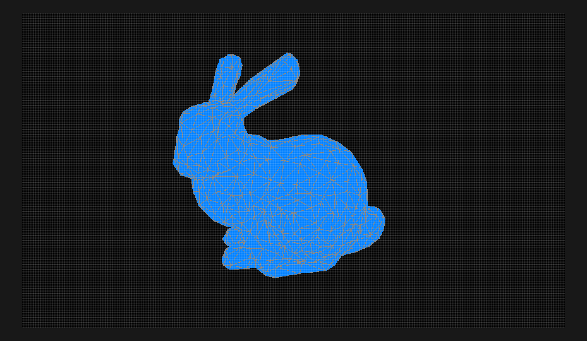

# Homework 1: Implement the Halfedge Structure

**Task 1. Build Halfedge-based mesh structure in the [`buildMesh`](./src/geometry/halfedge.ts) method, then render the mesh using the provided [software rasterizer](./src/).**



- _Hint: Don't work directly on a complex mesh, but try to start with a single triangle._
- Think about how to turn the learned data structure to code.
- Read blender's [developer documentation](https://wiki.blender.org/wiki/Source/Modeling/BMesh/Design), try to answer these questions:
- What is the blender's internal mesh data structure?
- How it works and what are the differences compare to Halfedge-based mesh strcture?

Write the answers here:

```
BMesh is designed to store vertices, faces, edges and loops. These element structures create connectivity cycles. Unlike a halfedge-based mesh structure faces of arbitrary length are possible. BMesh also allows for easier processing of manifold geometry. For example looking for neighbors of a vertex is very fast because every vertex knows which vertices it is connected to. With halfedge-based mesh this requires the use of halfedge-connectivity.
```

**Task 2. Write a reproducer of teaser image in [teaser.py](./teaser.py).**

- Tutorial: [The official Blender 2.8 Tutorial](https://www.youtube.com/playlist?list=PLa1F2ddGya_-UvuAqHAksYnB0qL9yWDO6), [Blender Guru's Beginner Tutorial Series](https://www.youtube.com/playlist?list=PLjEaoINr3zgEq0u2MzVgAaHEBt--xLB6U), etc.
- Checkout Blender's [Python API documentation](https://docs.blender.org/api/current/index.html).
- Use [the bunny model](./assets/bunny.obj) from GitHub repository, write a Python script that reproduce the course [teaser figure](../assets/teaser.png). To execute the script:

    ```sh
    $ blender -b -P ./teaser.py
    ```

**Task 3. Think about your individual project ideas.**

- _Hint: See submitted projects from last year in https://github.com/mimuc/gp/tree/ws2021#final-projects_

Write initial ideas here:

```
Probably something related to Progressive Meshes, unless I have another project idea that interests me more. Since there is an abundance of possible projects in that area, I will keep thinking about this until the end of the year.
```

## Submission Instruction

In short: Send a [pull request](https://github.com/mimuc/gp/pulls).

To submit a solution, one should create a folder named by the corresponding GitHub username in the `homeworks` folder and that folder will serve for all future submissions.

For example, in the `homeworks` folder, there is an existing folder `changkun`
that demonstrates how to organize submissions:

```
gp
├── README.md               <-- Top level README
├── 1-halfedge              <-- Project skeleton
└── homeworks
    └── changkun            <-- GitHub username
        └── 1-halfedge      <-- Actual submission
```
