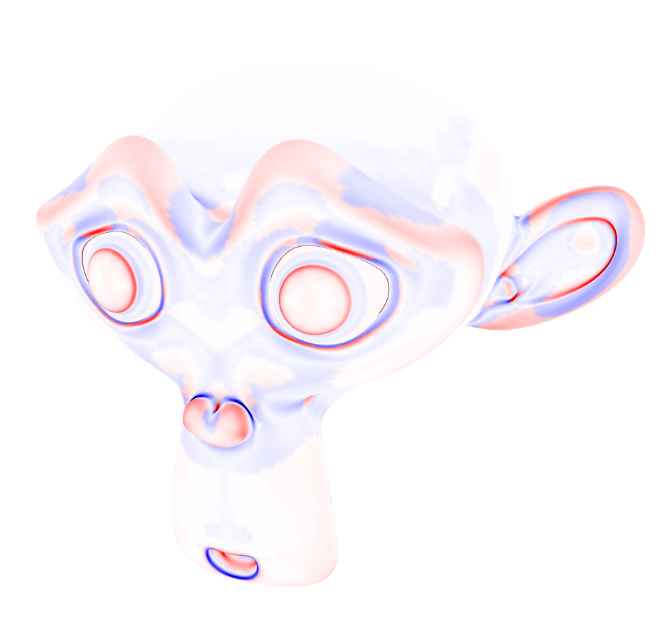
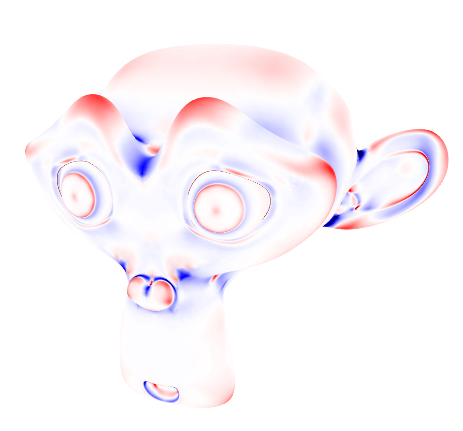
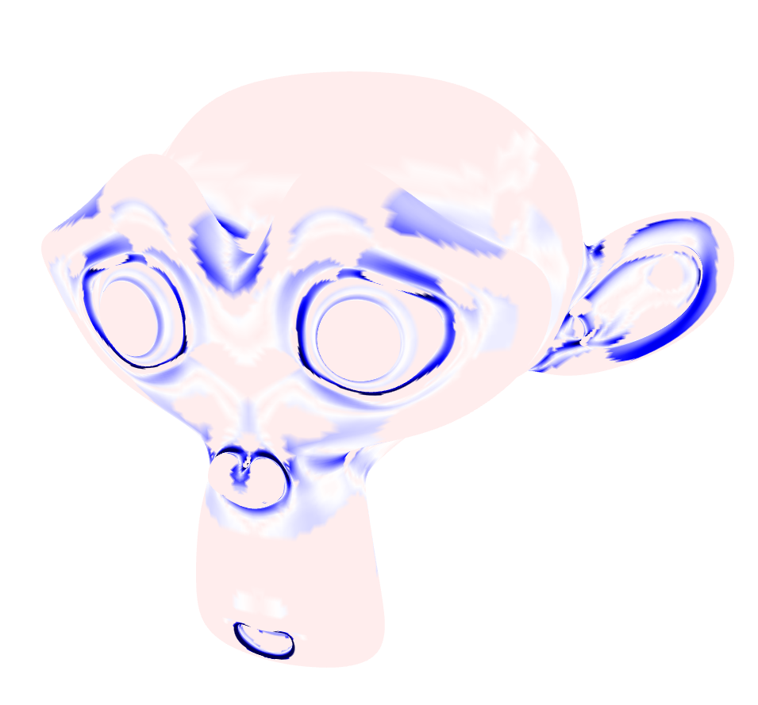
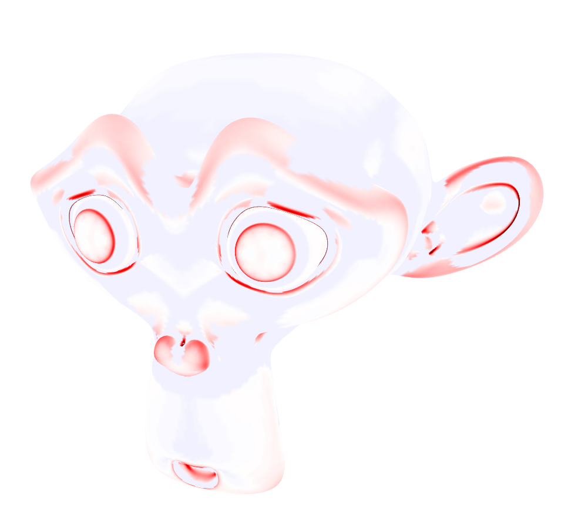

# Homework 2: Visualizing Curvatures

**Task 1. Use your halfedge mesh structure from [Homework 1](../1-halfedge/README.md), further extend the [geometry/primitive.ts](./src/geometry/primitive.ts) file and implement different normal and curvature computing methods.**

|Mean|Gauss|Kmin|Kmax|
|:--:|:--:|:--:|:--:|
|||||

**Task 2. Answer the following questions.**

Which code snippet (report in line numbers) in the `geometry/primitive.ts` is the most time consuming for you to implement? Explain your coding experience and encountered challenges briefly.

```
TODO: your answer goes here
The most time consuming piece of code to write was by far the mean curvature. It took me roughly 2h to find a simpler formula for the voronoi cell. Only on the 15.11 during our discussion in class did i correctly understand what the laplace Beltrami formula calculates.
```

Describe an impressive bug that you wrote while implementing this project, and briefly explain how you fixed it.

```
TODO: your answer goes here
Wrong calculation of kmin and kmax. Pretty messy solution by recalculating k1 and k2 with the correct mean curvature. There is probably a very nice solution, but I'm too tired and lazy to look for it.
```

## Submission Instruction

In short: Send a [pull request](https://github.com/mimuc/gp/pulls).

To submit a solution, one should create a folder named by the corresponding GitHub username in the `homeworks` folder and that folder will serve for all future submissions.

For example, in the `homeworks` folder, there is an existing folder `changkun`
that demonstrates how to organize submissions:

```
gp
├── README.md               <-- Top level README
├── 2-ddg                   <-- Project skeleton
└── homeworks
    └── changkun            <-- GitHub username
        └── 2-ddg           <-- Actual submission
```
