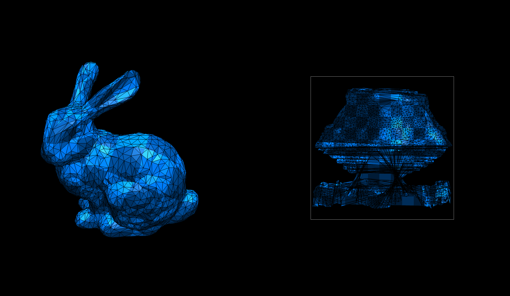
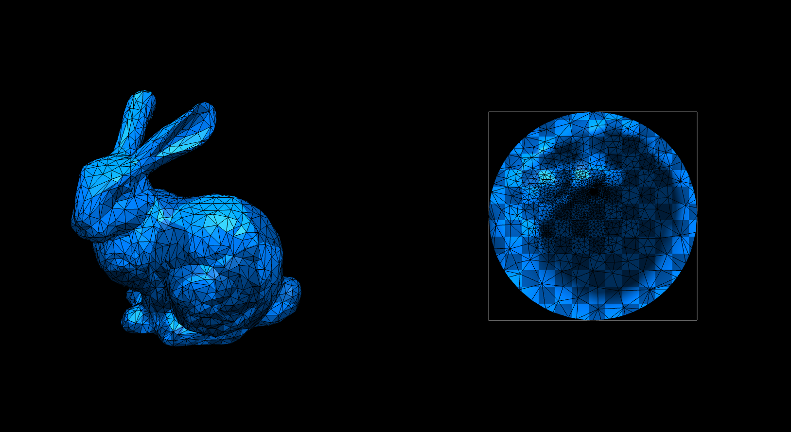
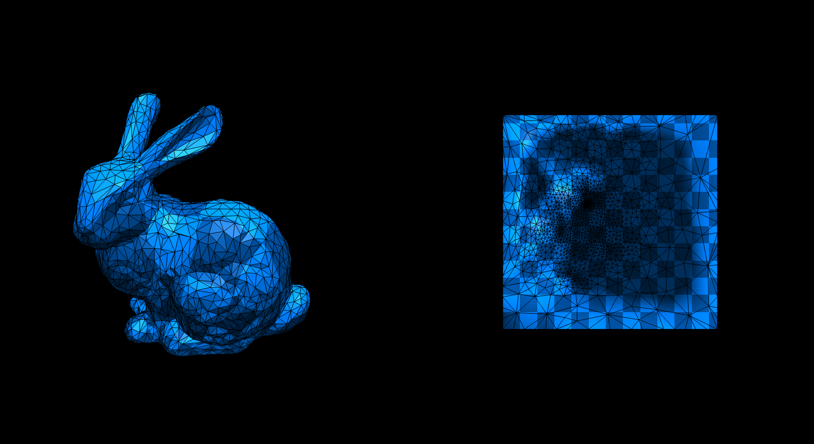
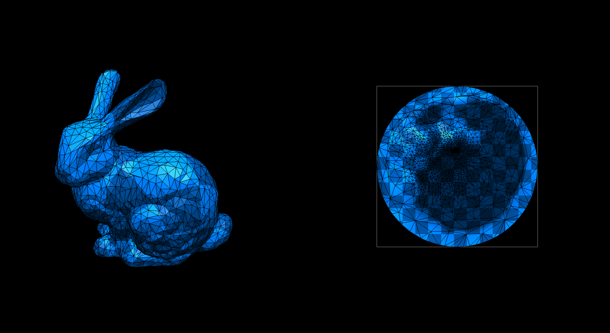
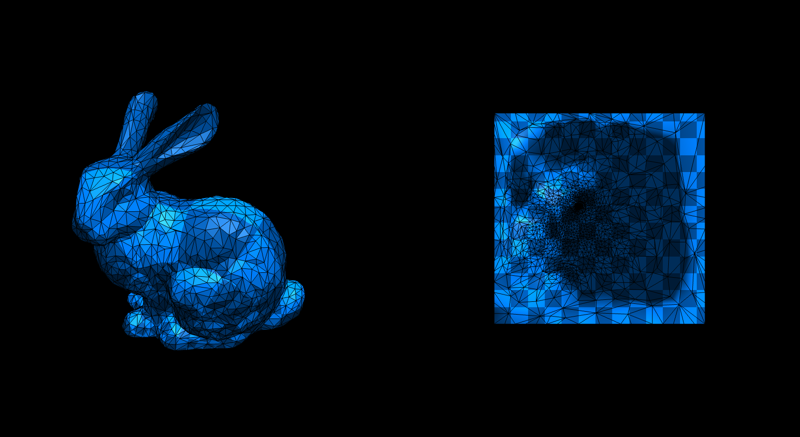

# Homework 4: Tutte's Barycentric Embedding

**Task 1. Use your halfedge mesh structure from [Homework 1](../1-halfedge/README.md), further extend the [geometry/mesh_param.ts](./src/geometry/mesh_param.ts) file and implement Tutte's barycentric embedding algorithm for mesh parameterization using for **uniform** and the **cotan** Laplacian weights.**

The original bunny mesh and parameterization:



The computed Tutte's parameterization:

|Laplacian|Disk|Rectangle|
|:--:|:--:|:--:|
|Uniform|||
|Cotan|||

_*Note that a mesh must contain at least one boundary._

**Task 2. Answer questions regarding the implementation.**

**Implementation complexity**: Which code snippet (report in line numbers) in the `geometry/mesh_param.ts` is the most time consuming for you to implement? Explain your coding experience and encountered challenges briefly.

```
TODO: your answer goes here
Definitely the rect case of computeBoundaryMatrices(line 121 - 157), since I already understood the concept of the solution and could reuse a lot of my old code. The rect calculation however was very primitive and unnecessarily complex. That is why I used a "flip" to get the correct values depending on the current position.
```

**Debugging complexity**: Describe an impressive bug that you wrote while implementing this project, and briefly explain how you fixed it.

```
TODO: your answer goes here
Just a stupid thinking error, when calculating the step variable I forgot to multiply with the number of sides of the rectangle.
The result is a bad distribution of the vertices and a kind of "spiderweb" appearance.
```

**Runtime performance**: Which part of your code could be a bottleneck and how the computation performance could be improved?

```
TODO: your answer goes here
I'm guessing if we could use something else than the lu solver, but not too sure if that is a true bottleneck, or if it would require a complete restructuring of the current code.
```

## Submission Instruction

In short: Send a [pull request](https://github.com/mimuc/gp/pulls).

To submit a solution, one should create a folder named by the corresponding GitHub username in the `homeworks` folder and that folder will serve for all future submissions.

For example, in the `homeworks` folder, there is an existing folder `changkun`
that demonstrates how to organize submissions:

```
gp
├── README.md                 <-- Top level README
├── 4-param                   <-- Project skeleton
└── homeworks
    └── changkun              <-- GitHub username
        └── 4-param           <-- Actual submission
```
