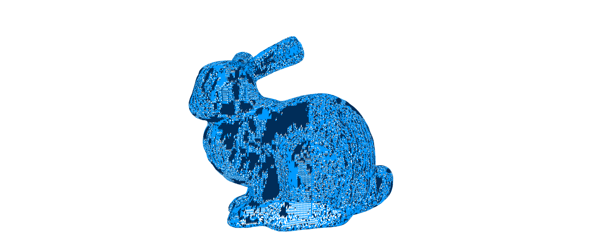
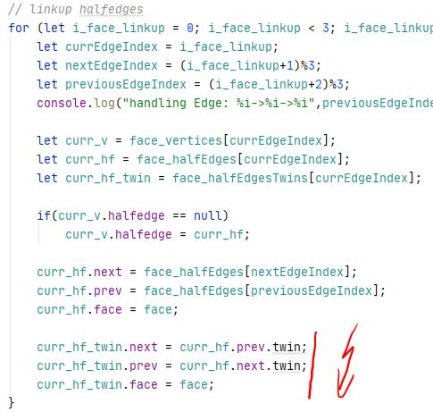

# Homework 2: Visualizing Curvatures

In this homework, you will be working on the implementation of curvature
visualization for manifold triangle meshes.

## Skeleton

The skeleton for this homework is structured as follows:

```
2-ddg
├── package.json
├── package-lock.json
├── README.md          <--- You work on this file
├── src
│   ├── assets
│   │   └── bunny_tri.obj
│   ├── colors.js
│   ├── halfedge.js    <--- You work on this file
│   ├── main.js
│   ├── renderer.js
│   └── vector.js
└── webpack.config.js
```

You coding tasks are located in the `halfedge.js`.
Please look for `TODO:` in these two files and complete them to archive
the reference results listed below.

> It might be useful to read the code in `main.js`.

You should also document your implementation process. Specifically, you
should answer the following questions:

1. Which code snippet (report in line numbers) in the `halfedge.js` is the most time consuming for you to implement? Explain your coding experience and encountered challenges briefly.

```
Writing the code for parsing the halfedge mesh (mainly lines 452-633) took the most time as you have to write a lot of code before you can even run a first test. So I had to constatnly double check and rethink if everything I wrote makes sense. After finishing the first version I got a bunny with "holes" (see 2.). Debugging and finding the reason took some time, I created other simpler meshes such as a plane with a few vertices for debugging.

After the fix, implementing the methods for the normals(lines 236-282) was no problem.

Implementing the curvature methods (lines 284-371) took some time too (but not as much as the parser). First I did interpret the formula completly wrong and did write just something wrong. After I understood the formula correctly, I had problems getting the correct colors. In my renders the bunny was always red. After some time, looking into the coloring code and asking in the Discussion Thread the reason was found :).
```

2. Describe an impressive bug that you wrote while implementing this project, and briefly explain how you fixed it.

```
Bunny was rendered with "holes".
```



```
After some debugging I found that I accidentally also set the 'previous' and 'next' values for the twin edges of an face. This in turn destroyed the linkup of all faces adjacent to the current face. -> all surrounding faces of of one face could not be rendered correctly. After removing the wrong assignments everything renders correctly.
```



## Reference Results

## Submission

Before you submit, please read [this](../README.md) document and understand
how you should organize your submitted files.

For this project, you should submit the following files (i.e. exclude the `assets` folder):

```
├── package.json
├── package-lock.json
├── README.md
├── src
│   ├── colors.js
│   ├── halfedge.js
│   ├── main.js
│   ├── renderer.js
│   └── vector.js
└── webpack.config.js
```

To submit your solution, please send a [pull request](https://github.com/mimuc/gp/pulls) before 30.11.2020 00:00:00.

If you have any questions regarding the skeleton, please comment on [this issue](https://github.com/mimuc/gp/issues/2).