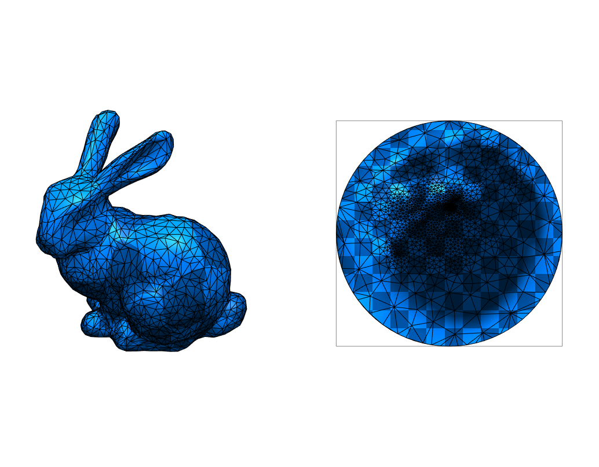
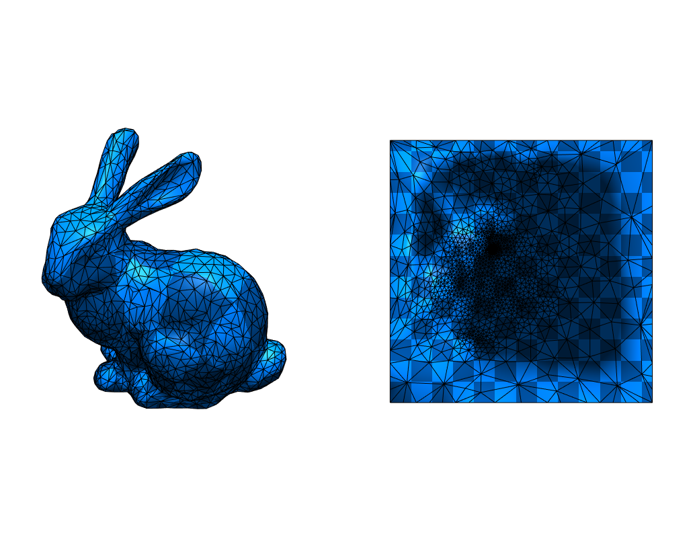
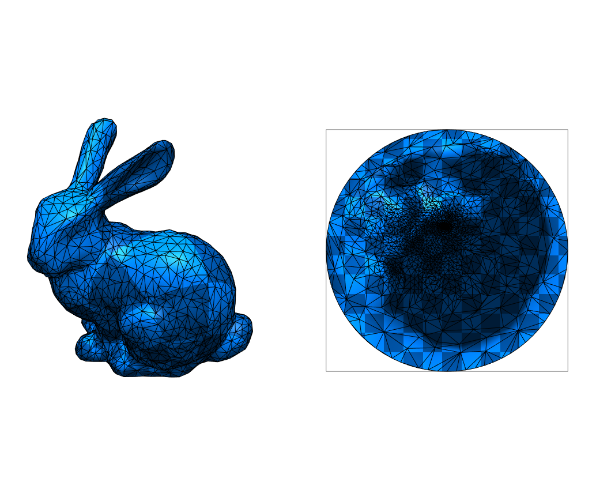
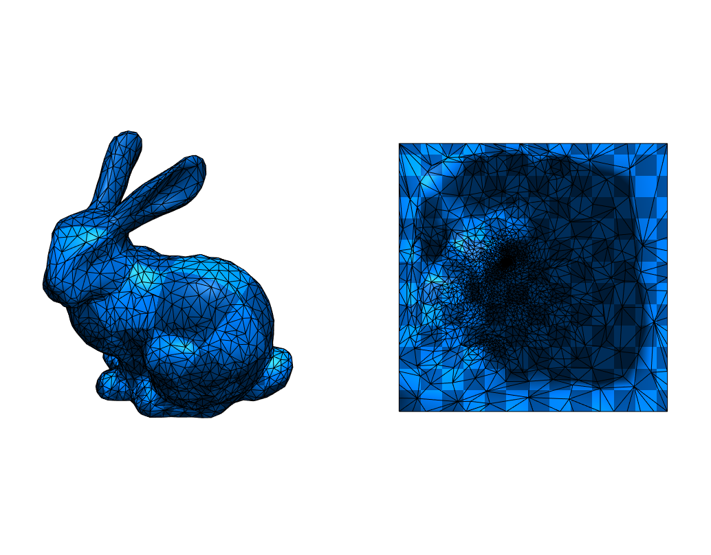

# Homework 4: Tutte's Barycentric Embedding

In this homework, your task is to implement the Tutte's barycentric embedding
for mesh parameterization for different types of boundary and Laplacian weights.

## Skeleton

The skeleton for this homework is structured as follows:

```
3-smooth
├── package.json
├── package-lock.json
├── README.md             <--- You work on this file
├── src
│   ├── assets
│   │   └── bunny_tri.obj
│   ├── halfedge.js       <--- You work on this file
│   ├── main.js
│   ├── renderer.js
│   └── vec.js
└── webpack.config.js
```

You coding tasks are located in the `halfedge.js`.
Please look for `TODO:` in these two files and complete them to archive
the reference results listed below.

> It might be useful to read the code in `main.js`.

You should also document your implementation process. Specifically, you
should answer the following questions:

1. **Implementation complexity**: Which code snippet (report in line numbers) in the `halfedge.js` is the most time consuming for you to implement? Explain your coding experience and encountered challenges briefly.

```
TODO: your answer goes here
```
line 519 to 527: Calculating the boundary was very hard since there wasn't something explicit in the slides to go by. Additionally, how to find the boundary vertices was really hard.

2. **Debugging complexity**: Describe an impressive bug that you wrote while implementing this project, and briefly explain how you fixed it.

```
TODO: your answer goes here
```
My uv coordinates were shifted for the disk calculation. This was fixed by translating the solution of the linear equation upwards by 0.5 on the u and v coordinates (or x and y).

## Reference Results

The UV coordinates of the bunny mesh computed by Tutte's barycentric embeeding:

|Laplacian|Disk|Square|
|:--:|:--:|:--:|
|Uniform|||
|Cotan|||

## Submission

Before you submit, please read [this](../README.md) document and understand
how you should organize your submitted files.

For this project, you should submit the following files (i.e. exclude the `assets` folder):

```
├── package.json
├── package-lock.json
├── README.md
├── src
│   ├── halfedge.js
│   ├── main.js
│   ├── renderer.js
│   └── vec.js
└── webpack.config.js
```

To submit your solution, please send a [pull request](https://github.com/mimuc/gp/pulls) before 11.01.2021 00:00:00.

If you have any questions regarding the skeleton, please comment on [the discussion thread](https://github.com/mimuc/gp/discussions/4).
