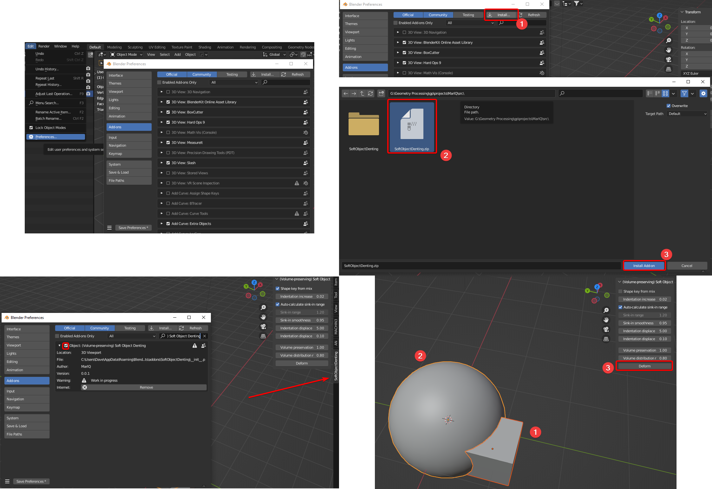
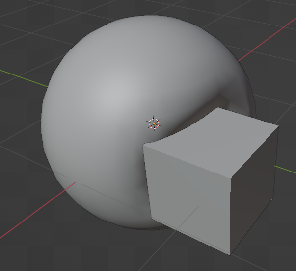

# (Volume-preserving) Soft Object Denting
## Functionality

Consider the situation where you have a soft object (e.g. a squishy ball), and a hard object (e.g. a hand).
You want the soft object to deform when the hard object presses into it.
But you do not want to sculpt this deformation by hand, nor do you want a complicated physics simulation.

This project provides a quick and dirty solution for this, without any kind of simulation.
Simply put the hard object into the soft object at the final position where it should be.
Then you just execute the script.

Because the algorithm has no concept of time or force, the results are obviously not physically accurate.

Video demo: https://www.youtube.com/watch?v=taOCVPt3nzI

## How to install
Similarly to other Blender addons, go to Edit -> Preferences -> Add-ons inside Blender.
Then click on Install... in the top-right and select the SofObjectDenting.zip in the src folder (or zip the SofObjectDenting folder yourself).
Then enable the addon from the list (it should be in the category Object) by clicking the checkbox.

The SoftObjectDenting addon panel can then be found in the N-Panel on the right (accessed by pressing 'N'), while in object mode.

## How to use
Select two objects. 
The first selected object is considered the hard object, the last selected object (active object) is considered the soft object.
Then, press the Deform button.

For the script to work properly, the two objects have to have overlapping vertices (otherwise the script will do nothing).
The soft object should also be convex in the overlapping area, or the resulting geometry will be messed up (just as in real life its impossible to compress a non-convex shape).

The script tends to perform better on subdivided objects, though superfluous geometry on the hard object can worsen results (which is why the addon temporarily applies a Planar decimate).

### Result

### Parameters:
- **Shape key from mix:** Creates the new shapekey from a mix of all current shape keys.
- **Use decimate:** Applies a temporary decimate modifier on the hard object, which can help eliminate unnecessary geometry which could affect the deformation.
- **Indentation increase:** Additional displacement on the intersecting area. 
A positive displace increase creates a gap between the objects.
- **Auto-calculate sink-in range:** Calculate the sink-in distance (see below) based on the root of the indentation depth (recommended).
- **Sink-in distance:** The radius at which a sink-in effect is applied around the intersecting area.
- **Delta initial:** The distance between vertices that determines which hard object vertices a vertex of the soft object is affected by.
Higher values create more even displacement, but can cause issues when the objects have mutliple intersections (see issue 4).
Low values can create mesh distortion.
- **Delta increase:** the value by which delta increases when searching for surrounding vertices (if the initial delta was not high enough).
Leaving this at 0 can cause the script to run indefinitely if no neighbouring vertices are found.
- **Volume preservation:** How much volume is conserved.
Realistically, something with pressure (like a balloon) would have a factor of 1, while a soft ball would have a much lower factor.

## How does it work

First, all overlapping vertices of both the soft object and the hard object are computed.
All overlapping vertices of the soft object are then displaced along the average normal of all overlapping vertices of the hard object (inside the delta distance parameter) until they hit the edges of the hard object.
Sink-in creates additional displacement around the overlapping areas.
The total displacement distance is accumulated, and then distributed across the rest of the mesh according to the volume preservation function.
## Current issues

1. Because the volume preservation works with displaced distance and not displaced volume, it is only accurate if the mesh geometry is somewhat even.

2. Sometimes, vertex normals are not correctly calculated and so the soft object is deformed weirdly, but I'm not sure why.
Entering and leaving Edit mode on the soft object fixes it.

3. Currently, multiple overlap/indentation areas can affect each other, as they are not isolated properly.
A smaller delta can counteract this somewhat.

4. The soft object may still overlap with the hard object because the deformation is based on overlapping vertices, not faces/edges.
