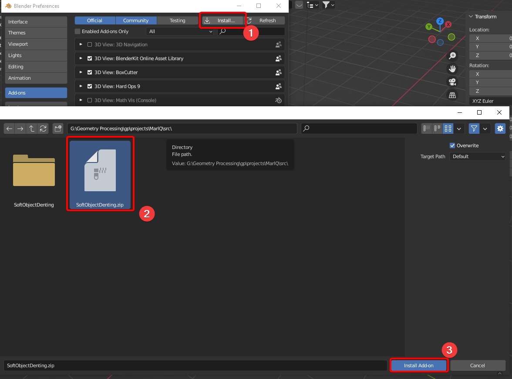

# (Volume-preserving) Soft Object Denting
## Functionality

Consider the situation where you have a soft object (e.g. a squishy ball), and a hard object (e.g. a hand).
You want the soft object to deform when the hard object presses into it.
But you do not want to sculpt this deformation by hand, nor do you want a complicated physics simulation.

This project provides a quick and dirty solution for this, without any kind of simulation.
Simply put the hard object into the soft object at the final position where it should be.
Then you just execute the script.

Because the algorithm has no concept of time or force, the results are obviously not physically accurate.
## How to use
Select two objects. 
The first selected object is considered the hard object, the last selected object (active object) is considered the soft object.
Then, execute the script (preferably from inside a Python editor window, using run script - shortcut Alt + P).

For the script to work properly, the two objects have to have overlapping vertices (otherwise the script will do nothing).
The soft object should also be convex in the overlapping area, or the resulting geometry will be messed up (just as in real life its impossible to compress a non-convex shape).

Having a subdivided hard object (applied) may improve results.
Similarly, subdividing the soft object may smooth out some of the resulting artifacts.

### Parameters:
- **Elasticity distance:** The distance at which elasticity displacement takes effect.
Elasticity is an additional displacement along vertex normals around the object intersection.
- **Elasticity factor:** The scale factor of how strong the elasticity effect is.
An elasticity factor of 1 would mean full displacement if the vertices have a distance of 0 to the intersection.
A factor of 0 disables elasticity.
- **Displace increase:** Additional displacement on the intersecting area. 
A positive displace increase creates a gap between the objects.
- **Volume preservation:** How much volume is conserved.
Realistically, something with pressure (like a balloon) would have a factor of 1, while a soft ball would have a much lower factor.
- **Delta initial:** The distance between vertices that determines which hard object vertices a vertex of the soft object is affected by.
Higher values create more even displacement, but can cause issues when the objects have mutliple intersections (see issue 4).
Low values can create mesh distortion.
- **Delta increase:** the value by which delta increases when searching for surrounding vertices (if the initial delta was not high enough).
Leaving this at 0 can cause the script to run indefinitely if not neighbouring vertices are found.

## How does it work

First, all overlapping vertices of both the soft object and the hard object are computed.
All overlapping vertices of the soft object are then displaced along the average normal of all overlapping vertices of the hard object (inside the delta distance parameter) until they hit the edges of the hard object.
Elasticity creates additional displacement around the overlapping areas.
The total displacement distance is accumulated, and then distributed across the rest of the mesh according to the inverse square law based on the distance to the overlap.
## Comparison to other solutions

**Sculpting:** My solution takes significantly less effort and time, and provides more realistic results in terms of volume preservation.
Detail and geometry might be better when sculpting, however.

**Dynamic Paint:** Displacement using dynamic paint is not volume preserving, and can result in some artifacts. 
It is also troublesome to use with shape keys, and slows down animation.
My solution has none of these problems.

**Shrinkwrap:** Shrinkwrap can only be used as long as the nearest surface point of the hard object is not on the other side.
It also requires the usage of vertex groups.

**Boolean**: Booleans cause major changes to the mesh geometry, adding new vertices, and generally breaking edge flow.
Also not volume preserving.

**Soft body simulation:** ...
## Current issues

1. Since all overlapping vertices are displaced by the same vector, there can be a lot of stretching along the edges of overlap.
Some might consider this desirable, however.
A higher elasticity factor counteracts this somewhat.

2. Because the volume preservation works with displaced distance and not displaced volume, it is only fully volume preserving if the mesh geometry is even.

3. There seems to be a bug with creating shapekeys from mix, where repeatedly running the script increases its effect even when shape keys are deleted.
Entering edit mode and immediately leaving seems to fix this.

4. Because deformation of a vertex is currently based on all vertices around it, vertices that should not realistically affect it still can affect it.
This can be a problem if the hard object intersects with the soft object multiple times in close proximity.

5. The soft object may still overlap with the hard object because the deformation is based on overlapping vertices, not faces.

## TODO

- Fix issue 4 by handling each overlapping area separately.
- Turn this into an addon.
- Support various shapekey settings.
- Fix issue 5 by displacing faces, or additionally displace vertices attached to overlapping faces.
- Fix issue 1 through interpolation of the displacement directions (results may vary).
- Fix issue 2 by approximating the volume (not sure if this will actually improve the quality much).