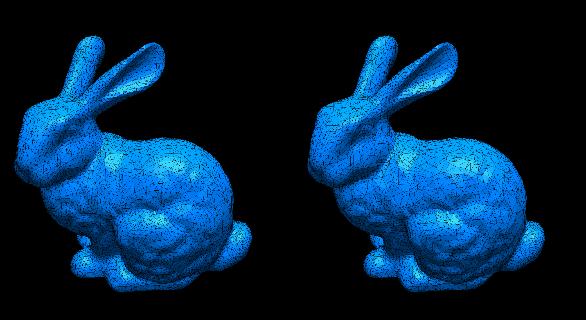
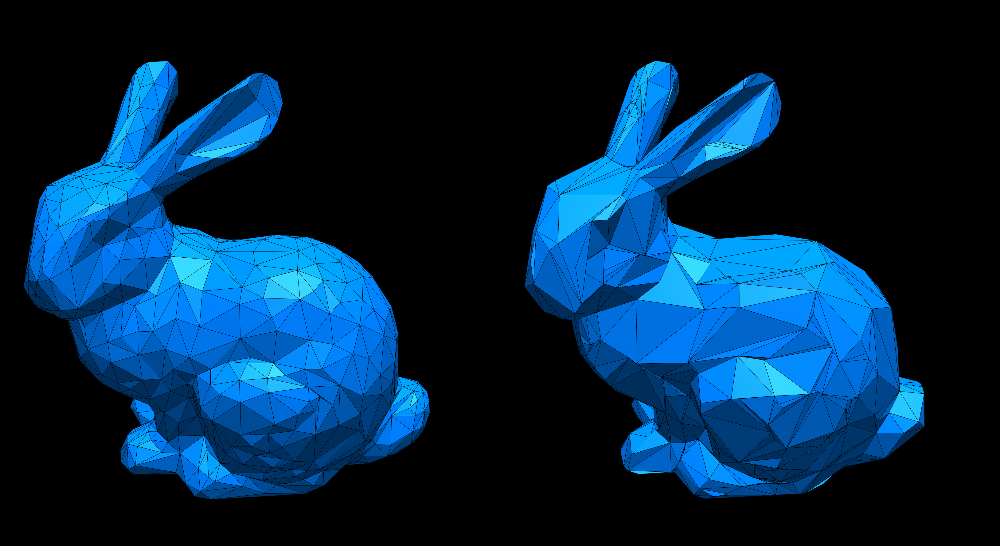

# Homework 5: Quadric Error Metric Simplification

**Task 1. Use the provided code template to implement the QSim algorithm (see `halfedge.ts` and `primitive.ts`).**

Here are example outputs:

|ReductionRatio|`r=0.0`|`r=0.50`|`t=0.90`|`t=0.95`|
|:--:|:--:|:--:|:--:|:--:|
|Bunny|||||
|Rocket ARM|||||

- Left: Simplified using Qsim (QEM)
- Right: Simplified using `SimplifyModifier` (from three.js)

**Task 2. Answer questions regarding the implementation.**

**Implementation complexity**: Which code snippet (report in line numbers) in the `geometry/primitive.ts` or `geometry/halfedge.ts` is the most time consuming for you to implement? Explain your coding experience and encountered challenges briefly.

```
TODO: your answer goes here
```

**Debugging complexity**: Describe an impressive bug that you wrote while implementing this project, and briefly explain how you fixed it.

```
TODO: your answer goes here
```

**Runtime performance**: Which part of your code could be a bottleneck and how the computation performance could be improved?

```
TODO: your answer goes here
```

## Submission Instruction

In short: Send a [pull request](https://github.com/mimuc/gp/pulls).

To submit a solution, one should create a folder named by the corresponding GitHub username in the `homeworks` folder and that folder will serve for all future submissions.

For example, in the `homeworks` folder, there is an existing folder `changkun`
that demonstrates how to organize submissions:

```
gp
├── README.md               <-- Top level README
├── 5-remesh                <-- Project skeleton
└── homeworks
    └── changkun            <-- GitHub username
        └── 3-smooth        <-- Actual submission
```
