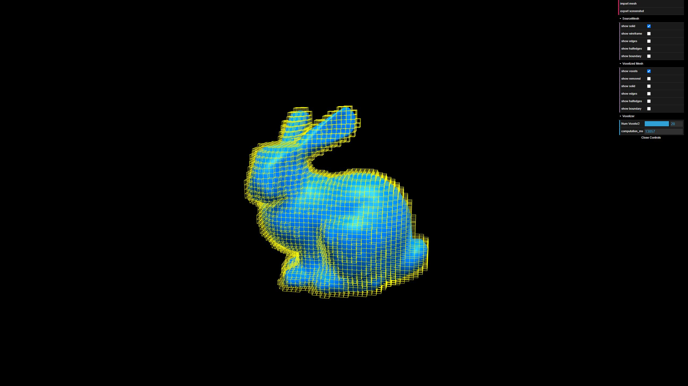
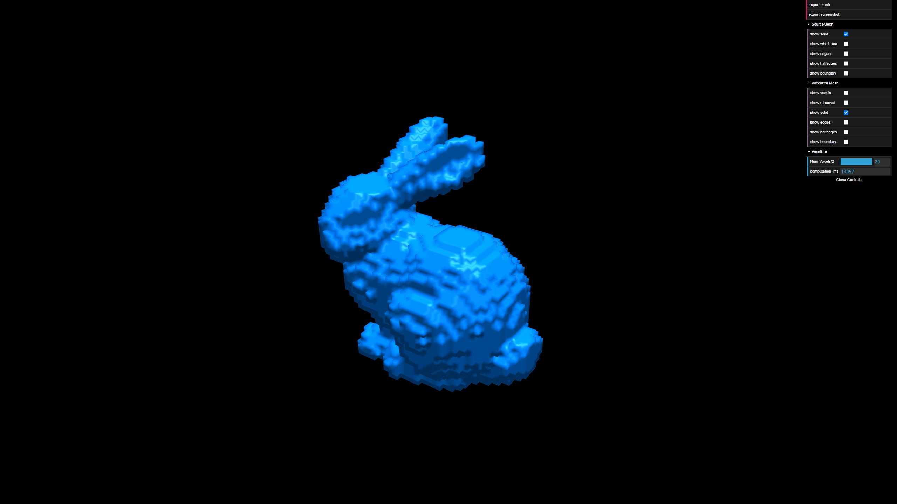

# Individual Project - Voxelizer

|||

# About
This project performs surface voxelization on an input mesh that is stored in an a h.e.d.s.
The resulting voxelized mesh is then modified such that it can also be (efficiently) stored in a h.e.d.s.
To visualize the h.e.d.s. and the modifications after voxelization, the user interface has been extended with
the following controlls (for both input and created mesh):
1) Show edges (source and created)
2) Show halfedges (source and created)
3) Show boundary halfedges (if extisting, both source and created)
4) For the voxelized mesh only: show removed inner vertices

# Usage
npm install & npm start should open a new browser image with the above UI.

