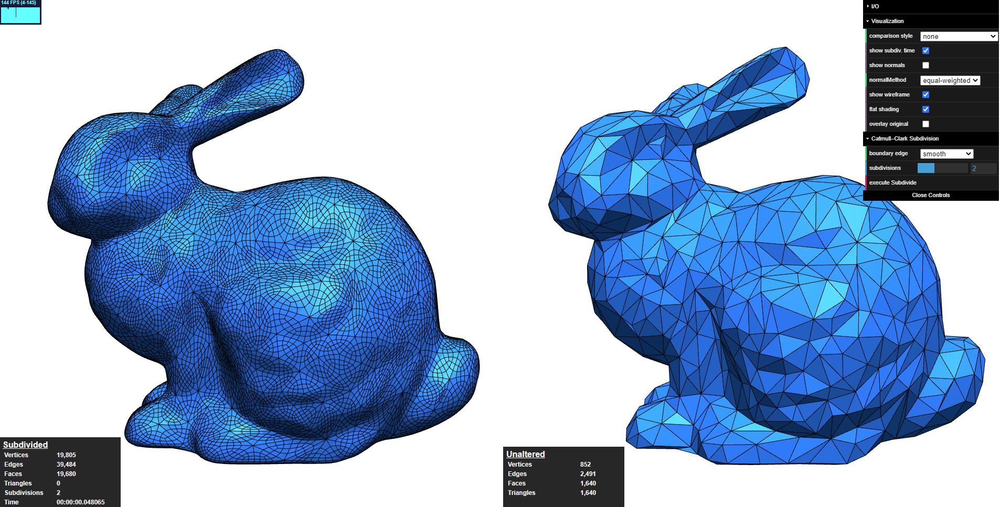

# Catmull–Clark Subdivision for a Halfedge-Mesh structure

krasnor

28.02.2021



## About

This project is implements the Catmull-Clark subdivision algorithm and quadrilateral face support for a halfedge-mesh structure.

## How-To Run

**Software Requirements**

- Node.js (v14+)
- Web Browser

**Installation**

1. Install dependencies
   Open a command line in the directory where "package.json" is located (this directory) and run
   
   `npm i` or `npm install`
   
2. Start the server

   `npm start`

3. The webpage should open automatically in your browser

   `http://localhost:8080/`

   

## Project Structure

This project is based on the template of homework 5 and was extended for Quad-Mesh support and Catmull-Clark subdivision.

The structure is as follows:

```
krasnor                      
├── package.json
├── package-lock.json
├── README.md                <-- this file
├── src
│   ├── assets
│   │   ├── bunny_tri_medium.obj
│   │   ├── ...
│   │   └── uv_sphere_triangulated.obj
│   ├── halfedge.js          <-- Halfedge-Mesh & Catmull-Clark subdivision
│   ├── LoadingOverlay.js    <-- Code of the loading overlay
│   ├── main.js              <-- UI handling and Halfedge-Mesh triangulation
│   ├── renderer.js
│   ├── StatisticsPanel.js   <-- Code of the statistics panels
│   └── vec.js
└── webpack.config.js
```

The Catmull-Clark subdivision is implemented in the method in the class `HalfedgeMesh` ( `_subdivide_once()` in halfedge.js). Three.js cannot render quadrilateral faces. In this implementation the mesh is triangulated before the creation of the corresponding three.js objects. This is done in in `renderMeshLeft()` (in main.js). The loading overlay and statistics panel are created during runtime. The corresponding code can be found in  `LoadingOverlay.js` and `StatisticsPanel.js`.

## Notes

- How often you can subdivide a mesh will depend on your system, web browser and the mesh size (this mostly relevant for detailed meshes).

  - Many web browsers impose a limit on how much memory a web page can allocate (e.g. 4GB). 
  - So it may happen that the browser will run out of memory while subdividing to higher levels or loading a very detailed mesh.

- In the assets directory multiple demo meshes (.obj format) are provided, those can be imported over the on-screen menu.

- Own meshes (in .obj format) can be imported too. Currently only triangular and quadrilateral faces are supported.

- Switching to "flat shading" may help to further distinguish between original and subdivided mesh surface.

- Subdivision time may vary between different web browsers.

  

## References

- E. Catmull, J. Clark. Recursively generated B-spline surfaces on arbitrary topological meshes. November, 1978. https://doi.org/10.1016/0010-4485(78)90110-0.
- OpenJS Foundation. Node.js. Last visited February 28, 2021. https://nodejs.org/en/.
- Three.js. Last visited February 28, 2021. https://threejs.org/.