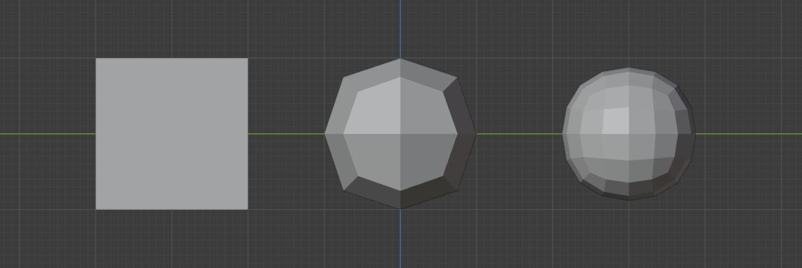

# Proposal: Catmull–Clark Subdivision for a Halfedge-Mesh structure

krasnor

16.01.2021

## Abstract

The goal of this project is to implement the Catmull–Clark subdivision algorithm for a halfedge-mesh structure. The halfedge-mesh structure must be capable of handling quadrilateral faces, as the algorithm can produce quadratic faces from triangle faces.

## Motivation

During the lecture we were introduced into the halfedge structure and various remeshing algorithms. In the exercises we got to know a down-sampling algorithm (QEM) much closer by implementing it, but we did not implement an up-sampling algorithm. Since I like the idea of altering the mesh structure via an algorithm I want to implement/extend the halfegde structure by an subdivision algorithm (Catmull-Clark). 

## Proposal

​		*A cube (left) subdivided with the Catmull-Clark subdivision algorithm after 1 (middle) and 2 (right) iterations. Example rendered with [Blender](https://www.blender.org/).*

I want to implement the Catmull-Clark subdivision algorithm [Catmull et al. 1978] for a halfedge-mesh structure [Kettner 2004]. During initial research I noticed that the algorithm can convert triangle faces into quadrilateral faces. Thus the halfedge structure must have quadrilateral face support. Additionally the visualization will support the user to compare the original mesh and subdivided mesh (along with additional information, such as vertex count) by displaying both versions at the same time next to each other. As remeshing is part of geometry processing this project is relevant to the lecture. 

I will use HTML5, Javascript, [Node.js](https://nodejs.org/) and the library [three.js](http://threejs.org/) for this project. 

The implementation of the halfedge structure will be based on the already known code from the exercises and lecture, but will be extended to be able to handle quadrilateral faces. The Catmull-Clark subdivision algorithm will be based on the original paper [Catmull et al. 1978], but be adjusted to use the halfedge structure instead of a matrix representation for the mesh. While the 3D-modelling software [Blender](https://www.blender.org/) also implements the Catmull-Clark subdivision algorithm with a halfedge structure it is written in C++, my implementation will be written in JavaScript and three.js. Thus the project is not based on an already existing code solution.

## Implementation

The project will be implemented in by the usage of HTML5, JavaScript, [Node.js](https://nodejs.org/) and [three.js](http://threejs.org/). 

Milestones will be:

1. Implementing halfedge connectivity to support quadrilateral faces
2. Adjust calculations for normals
3. Get three.js to handle the quadrilateral Mesh (as three.js dropped Face4 support)
4. Implement the Catmull–Clark Subdivision algorithm
5. Add support to compare the original mesh and subdivided mesh, along with additional information (such as vertex count)

Bigger challenge may encountered in Milestones 1, 3 and 4. 

- Milestone 1: a lot of code has to be adjusted to enable the support for quadrilateral faces, checking validity and debugging the generated mesh will be difficult.
- Milestone 3: Three.js does not support rendering of quadrilateral faces anymore,  thus another way has to be found to still render the halfedge structure with three.js. As this is mostly a visual problem and OpenGl typically would render the quadrilateral face as a pair of triangles my current approach will be to triangulate the mesh and overlay an wireframe material, that does only render the edges of the quadrilateral version of the mesh. This way the quadliteral version of the mesh can still be viewed.

- Milestone4:  The Catmull–Clark Subdivision algorithm is a major component of the project, thus must work. A big difficulty will be to correctly linkup all newly generated vertices with the current mesh-structure.  

## References

- Blender Foundation. Blender. Last visited January 17, 2021. https://www.blender.org/.
- E. Catmull, J. Clark. Recursively generated B-spline surfaces on arbitrary topological meshes. November, 1978. https://doi.org/10.1016/0010-4485(78)90110-0.
- L. Kettner. Chapter 29 Halfedge Data Structures. December 21, 2004 https://www.ics.uci.edu/~dock/manuals/cgal_manual/HalfedgeDS/Chapter_main.html.
- OpenJS Foundation. Node.js. Last visited January 17, 2021. https://nodejs.org/en/.
- Three.js. Last visited January 17, 2021. https://threejs.org/.
